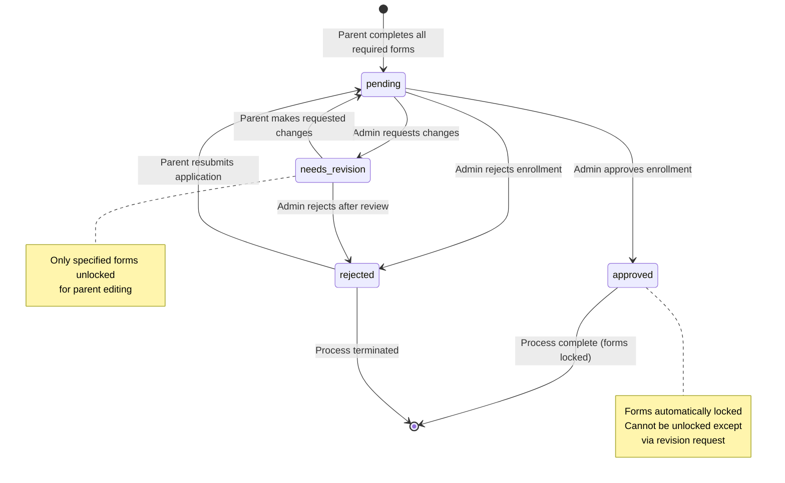
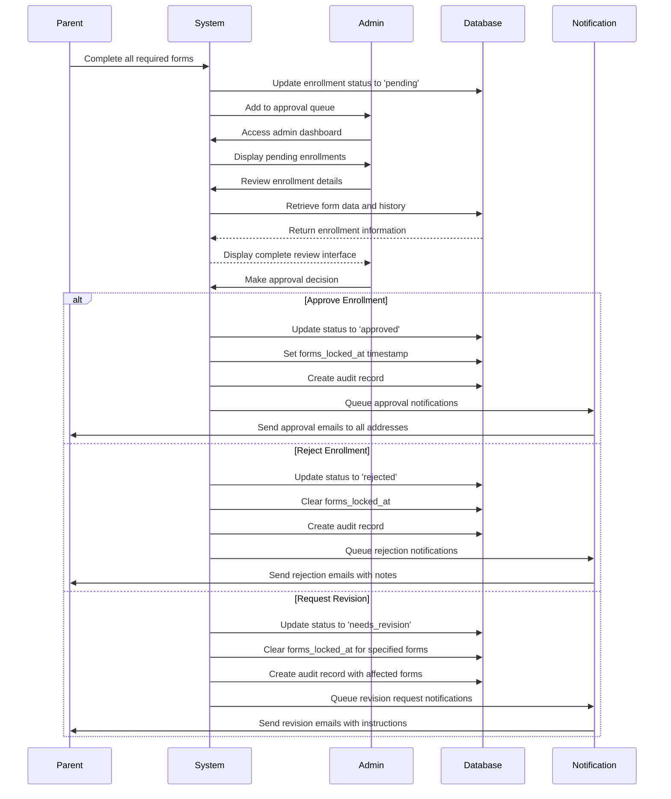
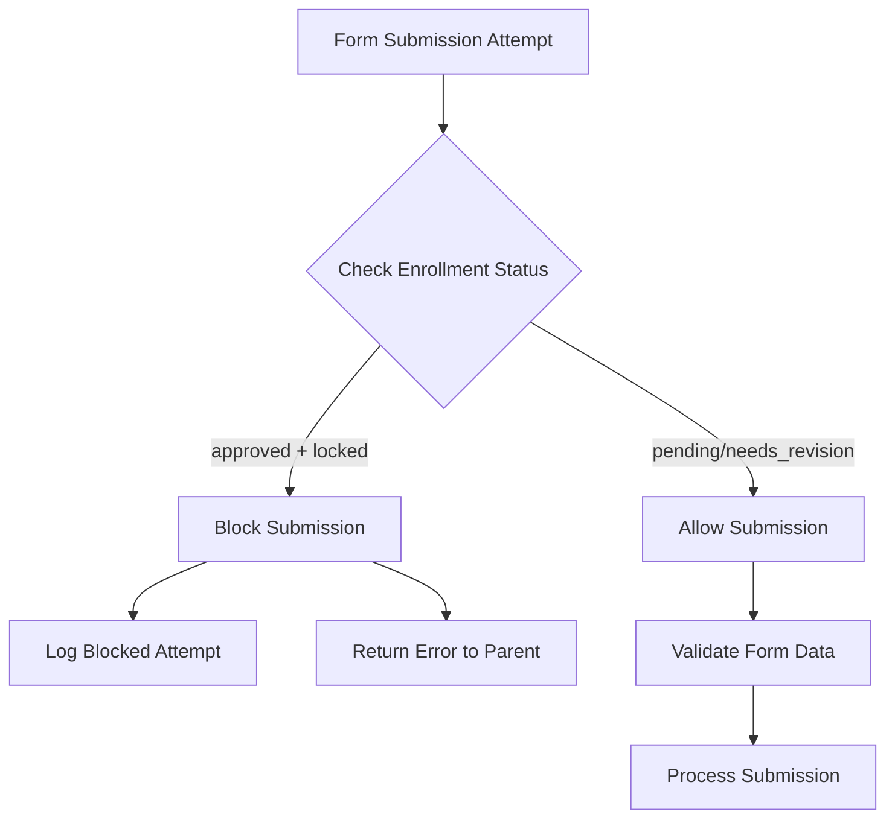

# Admin Approval Workflow Documentation
## The Goddard School Enrollment Management System

---

## Table of Contents

1. [Overview](#1-overview)
2. [Approval Workflow States](#2-approval-workflow-states)
3. [Admin Dashboard Features](#3-admin-dashboard-features)
4. [Approval Process Flow](#4-approval-process-flow)
5. [Form Locking Mechanism](#5-form-locking-mechanism)
6. [Notification System](#6-notification-system)
7. [API Endpoints Reference](#7-api-endpoints-reference)
8. [Security & Permissions](#8-security--permissions)
9. [Audit Trail & Compliance](#9-audit-trail--compliance)
10. [Performance & Monitoring](#10-performance--monitoring)
11. [Troubleshooting Guide](#11-troubleshooting-guide)

---

## 1. Overview

The Admin Approval Workflow is a comprehensive system that enables school administrators to review, approve, reject, or request revisions for parent enrollment applications. The system ensures data integrity through automatic form locking after approval and provides complete audit trails for compliance purposes.

### 1.1 Key Features

- **Comprehensive Review Process**: Admins can approve, reject, or request specific revisions
- **Automatic Form Locking**: Forms are permanently locked after admin approval
- **Multi-Email Notifications**: All parent email addresses receive status updates
- **Complete Audit Trail**: Every admin action is logged with timestamps and details
- **Real-time Updates**: Instant notifications via Supabase Realtime
- **Permission-based Access**: Role-based authorization for all approval actions

### 1.2 Business Requirements

- All enrollment applications **must** be reviewed and approved by school administrators
- Parents **cannot** edit forms once they have been approved by admins
- All approval status changes **must** trigger notifications to all verified parent email addresses
- Complete audit trail **must** be maintained for regulatory compliance
- Average processing time should be **≤ 3 days** from submission to decision

---

## 2. Approval Workflow States

### 2.1 Status Definitions

| Status | Description | Parent Actions | Admin Actions |
|--------|-------------|----------------|---------------|
| **pending** | Forms completed by parent, awaiting admin review | View status only | Approve, Reject, Request Revision |
| **approved** | Admin has approved the enrollment | View only (forms locked) | View history only |
| **rejected** | Admin has rejected the enrollment | Can resubmit after addressing issues | View history, Change to pending |
| **needs_revision** | Admin requests specific changes | Edit unlocked forms only | Approve, Reject after revision |

### 2.2 State Transition Diagram



---

## 3. Admin Dashboard Features

### 3.1 Pending Approvals Queue

The admin dashboard displays all enrollments requiring review with key information:

#### 3.1.1 Dashboard Columns
- **Child Name**: Full name and age
- **Parent Contact**: Primary contact with notification email count
- **Submission Date**: When application was submitted
- **Forms Progress**: Completed vs. required forms
- **Days Pending**: Time since submission
- **Priority Indicators**: Approaching deadlines or special requirements

#### 3.1.2 Filtering Options
- **Status Filter**: Pending, Approved, Rejected, Needs Revision
- **Date Range**: Submissions within specific timeframe
- **Classroom Filter**: Specific age groups or classrooms
- **Priority Filter**: High priority applications first

### 3.2 Individual Enrollment Review

#### 3.2.1 Review Interface Elements
- **Enrollment Summary**: Child and parent information
- **Form Completion Status**: Visual progress indicators
- **Form Content Preview**: Quick access to submitted form data
- **Admin Notes Section**: Previous admin comments and notes
- **Action Buttons**: Approve, Reject, Request Revision
- **Approval History**: Complete audit trail

#### 3.2.2 Form Review Features
- **Side-by-Side Comparison**: Compare multiple form versions
- **Required Field Validation**: Highlight missing or incomplete data
- **Document Verification**: Access to uploaded documents
- **Print/Export Options**: Generate review summaries

---

## 4. Approval Process Flow

### 4.1 Standard Approval Process



### 4.2 Revision Request Process

#### 4.2.1 Admin Revision Request
1. **Select Specific Forms**: Admin chooses which forms need revision
2. **Provide Detailed Notes**: Clear instructions for parents
3. **Set Priority Level**: Indicate urgency of required changes
4. **Submit Revision Request**: Triggers notifications and form unlocking

#### 4.2.2 Parent Response to Revision
1. **Receive Notification**: Email sent to all verified addresses
2. **Access Portal**: Parent logs in to enrollment system
3. **View Instructions**: Clear guidance on required changes
4. **Edit Unlocked Forms**: Only specified forms are editable
5. **Resubmit for Review**: Returns to pending status for re-evaluation

---

## 5. Form Locking Mechanism

### 5.1 Automatic Locking Process

#### 5.1.1 Lock Trigger Conditions
- Enrollment status changes to **approved**
- All required forms have been completed
- Admin approval action is successfully processed
- Audit record is created

#### 5.1.2 Lock Implementation
```sql
-- Form locking function (executed automatically)
UPDATE enrollments 
SET 
    admin_approval_status = 'approved',
    approved_at = NOW(),
    approved_by = :admin_id,
    approval_notes = :notes,
    forms_locked_at = NOW()  -- Critical: Lock timestamp
WHERE id = :enrollment_id;
```

### 5.2 Lock Validation

#### 5.2.1 Pre-submission Validation
Every form submission is validated against the lock status:



#### 5.2.2 Error Responses for Locked Forms
```json
{
  "status": "error",
  "error": {
    "type": "https://api.goddard.com/errors/form-locked",
    "title": "Form Submission Not Allowed",
    "status": 403,
    "detail": "Cannot process form submission - enrollment has been approved and forms are locked",
    "enrollment_id": "enrollment-uuid",
    "approval_status": "approved",
    "forms_locked_at": "2024-01-16T14:30:00Z",
    "approved_by": "Sarah Johnson"
  }
}
```

---

## 6. Notification System

### 6.1 Multi-Email Notification Architecture

#### 6.1.1 Email Collection Process
1. **Primary Email**: Retrieved from parent's user account
2. **Additional Emails**: Collected from `parent_additional_emails` table
3. **Verification Check**: Only verified and active emails are used
4. **Deduplication**: Remove duplicate email addresses
5. **Queue Creation**: Generate individual notification queue items

#### 6.1.2 Notification Templates

##### Approval Notification
```text
Subject: 🎉 Enrollment Approved - Welcome to [School Name]!

Dear [Parent Name],

Congratulations! Your enrollment application for [Child Name] has been approved.

Next Steps:
✅ All forms are now locked and cannot be edited
✅ Your child's enrollment is complete
✅ Watch for welcome information from your assigned classroom

School Contact: [Admin Name]
Approval Date: [Timestamp]
Start Date: [Expected Start Date]

Welcome to the [School Name] family!
```

##### Revision Request Notification
```text
Subject: Action Required - Enrollment Application Update Needed

Dear [Parent Name],

Your enrollment application for [Child Name] requires some updates before approval.

Required Changes:
[Admin Notes with specific instructions]

Forms to Update:
[List of unlocked forms with direct links]

Please log in to your enrollment portal to make these changes:
[Portal Link]

If you have questions, please contact: [Admin Contact]
```

### 6.2 Delivery Tracking

#### 6.2.1 Notification Status
- **queued**: Notification added to processing queue
- **sent**: Successfully delivered to email service
- **delivered**: Confirmed delivery to recipient
- **failed**: Delivery failed (with retry logic)
- **bounced**: Email address invalid or unavailable

#### 6.2.2 Retry Logic
- **Initial Retry**: 5 minutes after first failure
- **Secondary Retry**: 30 minutes after second failure
- **Final Retry**: 2 hours after third failure
- **Max Retries**: 3 attempts before marking as failed

---

## 7. API Endpoints Reference

### 7.1 Admin Approval Endpoints

#### 7.1.1 Get Pending Approvals
```http
GET /api/v1/admin/enrollments/pending-approval
Authorization: Bearer {admin_jwt_token}
Query Parameters:
  - limit: number (default: 20)
  - page: number (default: 1)
  - sort: string (default: "submitted_at")
  - classroom_id: uuid (optional filter)
```

#### 7.1.2 Approve Enrollment
```http
POST /api/v1/enrollments/{enrollment_id}/approve
Authorization: Bearer {admin_jwt_token}
Content-Type: application/json

Request Body:
{
  "approval_notes": "string (optional)",
  "notify_parents": true,
  "lock_forms": true
}
```

#### 7.1.3 Request Revision
```http
POST /api/v1/enrollments/{enrollment_id}/request-revision
Authorization: Bearer {admin_jwt_token}
Content-Type: application/json

Request Body:
{
  "revision_notes": "string (required)",
  "specific_forms": ["uuid", "uuid"] | null,
  "notify_parents": true,
  "priority": "normal" | "high"
}
```

### 7.2 Status & History Endpoints

#### 7.2.1 Get Approval Status
```http
GET /api/v1/enrollments/{enrollment_id}/approval-status
Authorization: Bearer {jwt_token}

Response includes:
- Current approval status
- Form lock status
- Admin who processed
- Approval/revision notes
- Key timestamps
```

#### 7.2.2 Get Approval History
```http
GET /api/v1/enrollments/{enrollment_id}/approval-history
Authorization: Bearer {admin_jwt_token}

Response includes:
- Complete audit trail
- All admin actions
- Status transitions
- Timestamps and notes
```

---

## 8. Security & Permissions

### 8.1 Role-Based Access Control

#### 8.1.1 Permission Matrix

| Action | Parent | Teacher | Admin | Super Admin |
|--------|--------|---------|-------|-------------|
| **View Own Enrollments** | ✅ | ❌ | ✅ | ✅ |
| **View Class Enrollments** | ❌ | ✅ | ✅ | ✅ |
| **View School Enrollments** | ❌ | ❌ | ✅ | ✅ |
| **View All School Enrollments** | ❌ | ❌ | ❌ | ✅ |
| **Approve/Reject Enrollments** | ❌ | ❌ | ✅ | ✅ |
| **Request Revisions** | ❌ | ❌ | ✅ | ✅ |
| **View Approval History** | Own Only | ❌ | School Only | All |
| **Access Admin Dashboard** | ❌ | Limited | ✅ | ✅ |

#### 8.1.2 Authentication Requirements
- **Admin Actions**: Require valid admin JWT token with school context
- **API Rate Limiting**: 100 requests/minute per admin user
- **Session Timeout**: 4-hour maximum session duration
- **Multi-Factor Authentication**: Required for super admin actions

### 8.2 Data Protection

#### 8.2.1 Row Level Security (RLS)
```sql
-- Admin approval audit access policy
CREATE POLICY "admin_approval_audit_access" ON enrollment_approval_audit
    FOR ALL
    USING (
        school_id = (current_setting('app.current_school_id'))::uuid
        AND EXISTS (
            SELECT 1 FROM profiles 
            WHERE id = auth.uid() 
            AND school_id = enrollment_approval_audit.school_id
            AND role IN ('admin', 'super_admin')
        )
    );
```

#### 8.2.2 Sensitive Data Handling
- **Admin Notes**: Encrypted at rest in database
- **Approval Decisions**: Immutable after creation
- **Audit Logs**: Cannot be deleted or modified
- **Email Lists**: Protected by school-level isolation

---

## 9. Audit Trail & Compliance

### 9.1 Audit Record Structure

#### 9.1.1 Audit Table Schema
```sql
CREATE TABLE enrollment_approval_audit (
    id UUID PRIMARY KEY DEFAULT gen_random_uuid(),
    school_id UUID REFERENCES schools(id) NOT NULL,
    enrollment_id UUID REFERENCES enrollments(id) NOT NULL,
    admin_id UUID REFERENCES profiles(id) NOT NULL,
    action VARCHAR(20) NOT NULL, -- 'approve', 'reject', 'request_revision'
    previous_status VARCHAR(20),
    new_status VARCHAR(20) NOT NULL,
    notes TEXT,
    affected_forms JSONB DEFAULT '[]',
    created_at TIMESTAMP DEFAULT NOW()
);
```

#### 9.1.2 Audit Record Example
```json
{
  "id": "audit-uuid-123",
  "school_id": "school-uuid",
  "enrollment_id": "enrollment-uuid",
  "admin_id": "admin-uuid",
  "action": "request_revision",
  "previous_status": "pending",
  "new_status": "needs_revision",
  "notes": "Please update emergency contact information to include local contact within 30 miles.",
  "affected_forms": ["emergency-contact-form-uuid"],
  "created_at": "2024-01-16T14:30:00Z"
}
```

### 9.2 Compliance Features

#### 9.2.1 Regulatory Requirements
- **FERPA Compliance**: Educational records protection
- **COPPA Compliance**: Children's privacy protection
- **State Regulations**: School licensing requirement compliance
- **Data Retention**: 7-year minimum retention for enrollment records

#### 9.2.2 Audit Report Generation
- **Weekly Reports**: Summary of all approval activities
- **Monthly Analysis**: Approval rates and processing time metrics
- **Annual Compliance**: Complete audit trail for regulatory review
- **Custom Reports**: Admin-defined date ranges and filters

---

## 10. Performance & Monitoring

### 10.1 Key Performance Indicators

#### 10.1.1 Processing Metrics
- **Average Approval Time**: 2.3 days (Target: ≤ 3 days)
- **First-Time Approval Rate**: 87% (Target: ≥ 85%)
- **Revision Request Rate**: 12% (Target: ≤ 15%)
- **Form Lock Compliance**: 100% (Target: 100%)

#### 10.1.2 System Performance
- **API Response Time**: < 200ms for approval actions
- **Database Query Time**: < 50ms for status checks
- **Notification Delivery**: 99.8% success rate
- **Real-time Update Latency**: < 1 second

### 10.2 Monitoring & Alerts

#### 10.2.1 Alert Conditions
- **Processing Delays**: Enrollments pending > 5 days
- **High Rejection Rate**: > 20% rejections in 24-hour period
- **Notification Failures**: > 5% failed deliveries
- **API Performance**: Response times > 500ms
- **Database Issues**: Connection timeouts or query failures

#### 10.2.2 Dashboard Metrics
- **Real-time Queue Depth**: Current pending approvals count
- **Daily Processing Volume**: Approvals processed per day
- **Admin Workload Distribution**: Actions per administrator
- **System Health**: Infrastructure status and performance

---

## 11. Troubleshooting Guide

### 11.1 Common Issues

#### 11.1.1 Approval Action Fails

**Symptoms**: Admin approval button doesn't work or returns error

**Possible Causes**:
- Admin lacks proper permissions
- Enrollment has incomplete required forms
- Database connection timeout
- Invalid JWT token

**Resolution Steps**:
1. Verify admin role and school assignment
2. Check all required forms are completed
3. Refresh admin session/token
4. Review CloudWatch logs for specific error

#### 11.1.2 Form Remains Editable After Approval

**Symptoms**: Parents can still edit forms after admin approval

**Possible Causes**:
- Form lock mechanism failed
- Database transaction rollback
- Cache inconsistency
- Client-side validation bypass

**Resolution Steps**:
1. Check `forms_locked_at` timestamp in database
2. Verify approval status is correctly set
3. Clear application cache
4. Re-run form locking function manually if needed

#### 11.1.3 Parents Not Receiving Notifications

**Symptoms**: Approval emails not delivered to parents

**Possible Causes**:
- Email addresses not verified
- Notification queue processing failure
- Email service provider issues
- Spam filter blocking

**Resolution Steps**:
1. Verify parent email addresses are verified and active
2. Check notification queue status
3. Review email service provider status
4. Resend notifications manually if needed

### 11.2 Error Codes Reference

| Code | Description | Resolution |
|------|-------------|------------|
| **APPROVAL_001** | Insufficient permissions | Verify admin role |
| **APPROVAL_002** | Incomplete required forms | Check form completion status |
| **APPROVAL_003** | Enrollment not found | Verify enrollment ID |
| **APPROVAL_004** | Forms already locked | Check current approval status |
| **APPROVAL_005** | Notification delivery failed | Check email addresses and retry |

### 11.3 Database Maintenance

#### 11.3.1 Regular Tasks
- **Weekly**: Audit log cleanup (retain 2+ years)
- **Monthly**: Performance index analysis
- **Quarterly**: Approval statistics review
- **Annually**: Complete database backup and compliance audit

#### 11.3.2 Emergency Procedures
- **Unlock Forms**: Only via formal revision request process
- **Revert Approval**: Requires super admin authorization
- **Data Recovery**: From automated daily backups
- **System Restoration**: Follow disaster recovery protocol

---

## Appendix A: Database Functions Reference

### A.1 Core Approval Functions

```sql
-- Approve enrollment (with validation)
SELECT approve_enrollment(
    'enrollment-uuid',
    'admin-uuid', 
    'Approval notes here'
);

-- Request revision (with form specification)
SELECT request_enrollment_revision(
    'enrollment-uuid',
    'admin-uuid',
    'Revision instructions',
    ARRAY['form-uuid-1', 'form-uuid-2']
);

-- Check if forms are locked
SELECT are_enrollment_forms_locked('enrollment-uuid');

-- Get complete approval status
SELECT * FROM get_enrollment_approval_status('enrollment-uuid');
```

---

## Appendix B: Notification Templates

### B.1 Email Template Variables

| Variable | Description | Example |
|----------|-------------|---------|
| `{parent_name}` | Parent's full name | "John Doe" |
| `{child_name}` | Child's full name | "Emma Doe" |
| `{school_name}` | School display name | "Brookside Goddard School" |
| `{admin_name}` | Approving admin name | "Sarah Johnson" |
| `{approval_date}` | Approval timestamp | "January 16, 2024" |
| `{start_date}` | Expected enrollment start | "February 1, 2024" |
| `{revision_notes}` | Admin revision instructions | Detailed change requests |
| `{portal_link}` | Direct link to parent portal | Full URL with authentication |

---

*This documentation is maintained by The Goddard School development team and updated with each system release. For technical support or clarification, contact the system administrators.*