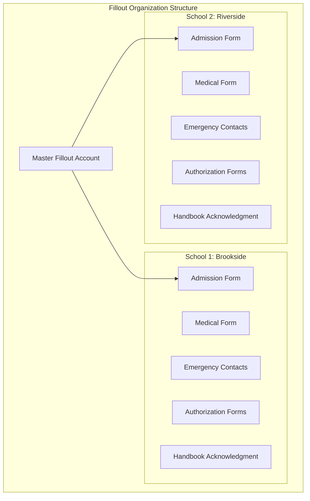
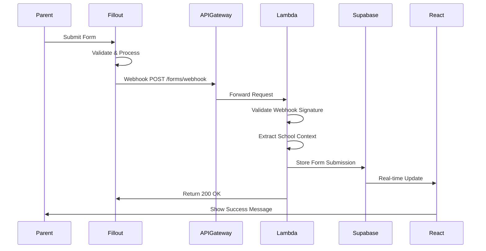
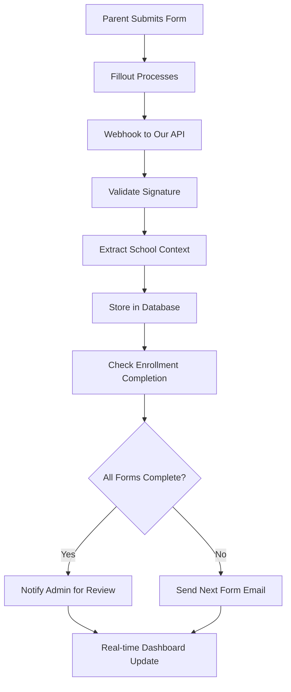
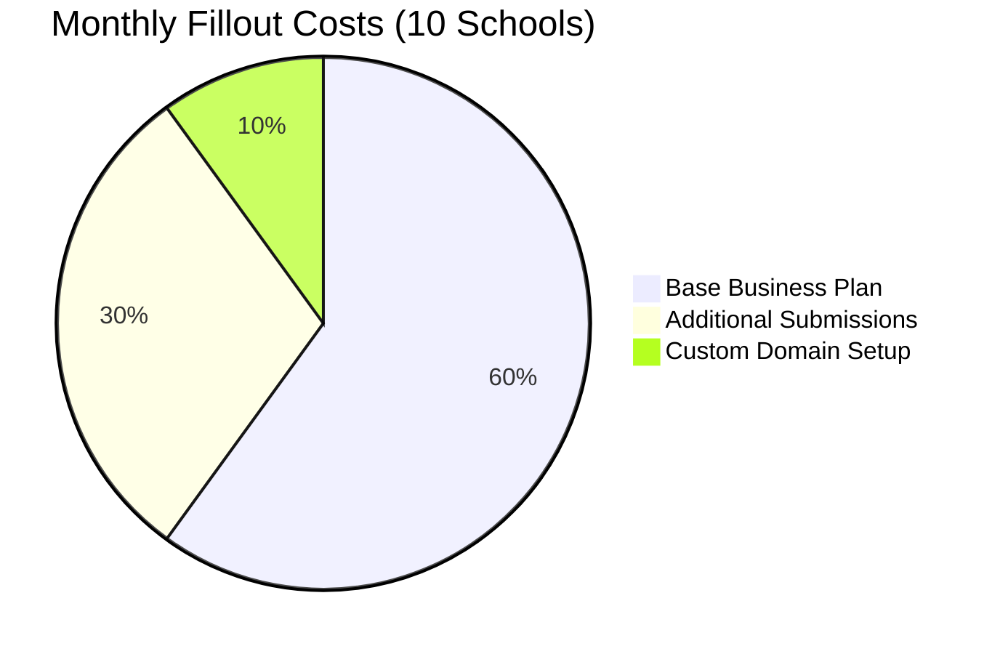
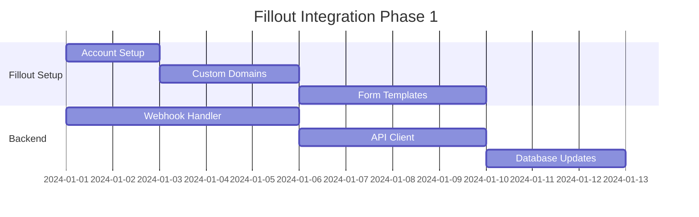
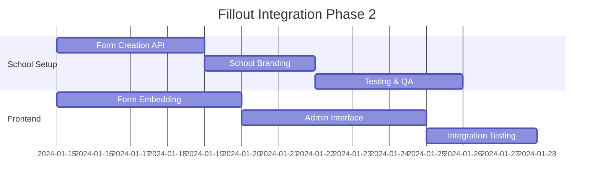

# Fillout.com Integration Strategy
## The Goddard School Enrollment Management System

### Executive Summary
This document outlines the comprehensive integration strategy for using Fillout.com as the primary form creation and management platform for The Goddard School system. Fillout will handle all 10+ enrollment forms with school-specific customization, while our backend processes submissions via webhooks.

---

## 1. Fillout Platform Overview

### 1.1 Key Capabilities
Based on research, Fillout.com provides:

- **Custom Domains**: Forms hosted at `forms.school.goddard.com`
- **White-Label**: Complete branding customization including favicon
- **REST API**: Full programmatic control over forms and submissions
- **Webhooks**: Real-time submission notifications to our backend
- **OAuth Authentication**: Secure API access with token refresh
- **Advanced Customization**: Colors, fonts, logos, positioning
- **Multi-Form Support**: Unlimited forms with different designs

### 1.2 Business Plan Features
- Custom domain hosting
- White-label capabilities
- API access and webhook integrations
- Higher submission limits
- Advanced branding options
- Priority support

---

## 2. Multi-Tenant Form Architecture

### 2.1 School-Specific Form Organization



### 2.2 Form Naming Convention
```
{school_subdomain}_{form_type}_{version}
Examples:
- brookside_admission_v1
- riverside_medical_v2
- oakwood_emergency_contacts_v1
```

### 2.3 Custom Domain Strategy
```
forms.brookside.goddard.com → Brookside forms
forms.riverside.goddard.com → Riverside forms
forms.oakwood.goddard.com → Oakwood forms
```

---

## 3. Integration Architecture

### 3.1 Form Embedding Patterns

#### Option A: iFrame Embedding (Recommended)
```typescript
// React component for form embedding
import React from 'react';

interface FilloutFormProps {
  formId: string;
  schoolId: string;
  parentId?: string;
  childId?: string;
  prefillData?: Record<string, any>;
}

export const FilloutForm: React.FC<FilloutFormProps> = ({
  formId,
  schoolId, 
  parentId,
  childId,
  prefillData
}) => {
  const baseUrl = `https://forms.${schoolId}.goddard.com`;
  const prefillParams = new URLSearchParams(prefillData || {});
  const embedUrl = `${baseUrl}/${formId}?${prefillParams.toString()}`;

  return (
    <div className="fillout-form-container">
      <iframe
        src={embedUrl}
        width="100%"
        height="600"
        frameBorder="0"
        title={`${schoolId} Form`}
        className="rounded-lg border"
      />
    </div>
  );
};
```

#### Option B: Direct Navigation
```typescript
// Navigate to Fillout form with context
export const navigateToForm = (
  formType: string, 
  schoolId: string, 
  enrollmentId: string
) => {
  const baseUrl = `https://forms.${schoolId}.goddard.com`;
  const formId = getFormId(formType, schoolId);
  const url = `${baseUrl}/${formId}?enrollment_id=${enrollmentId}&school_id=${schoolId}`;
  
  window.open(url, '_blank');
};
```

### 3.2 Webhook Integration Flow



---

## 4. Backend Integration Implementation

### 4.1 Webhook Handler (Rust Lambda)

```rust
// webhook/fillout.rs
use serde::{Deserialize, Serialize};
use lambda_runtime::{handler_fn, Context, Error};
use aws_lambda_events::event::apigw::ApiGatewayProxyRequest;

#[derive(Deserialize)]
pub struct FilloutWebhook {
    pub form_id: String,
    pub submission_id: String,
    pub created_at: String,
    pub data: serde_json::Value,
    pub metadata: WebhookMetadata,
}

#[derive(Deserialize)]
pub struct WebhookMetadata {
    pub ip_address: String,
    pub user_agent: String,
    pub referrer: Option<String>,
}

pub async fn handle_fillout_webhook(
    event: ApiGatewayProxyRequest,
    _context: Context,
) -> Result<serde_json::Value, Error> {
    // 1. Validate webhook signature
    let signature = event.headers
        .get("x-fillout-signature")
        .ok_or("Missing webhook signature")?;
    
    validate_webhook_signature(&event.body, signature)?;
    
    // 2. Parse webhook payload
    let webhook: FilloutWebhook = serde_json::from_str(&event.body)?;
    
    // 3. Extract school context from form_id
    let school_id = extract_school_from_form_id(&webhook.form_id)?;
    
    // 4. Process form submission
    let form_submission = FormSubmission {
        id: uuid::Uuid::new_v4(),
        school_id,
        fillout_form_id: webhook.form_id,
        fillout_submission_id: webhook.submission_id,
        form_data: webhook.data,
        submitted_at: chrono::DateTime::parse_from_rfc3339(&webhook.created_at)?,
        metadata: webhook.metadata,
    };
    
    // 5. Store in Supabase
    store_form_submission(&form_submission).await?;
    
    // 6. Trigger follow-up actions
    handle_form_completion_logic(&form_submission).await?;
    
    Ok(json!({ "status": "success" }))
}

fn validate_webhook_signature(body: &str, signature: &str) -> Result<(), Error> {
    let secret = std::env::var("FILLOUT_WEBHOOK_SECRET")?;
    let expected = hmac_sha256(&secret, body);
    
    if !constant_time_eq(&expected, signature) {
        return Err("Invalid webhook signature".into());
    }
    
    Ok(())
}
```

### 4.2 Fillout API Client

```rust
// fillout/client.rs
pub struct FilloutClient {
    api_key: String,
    base_url: String,
    client: reqwest::Client,
}

impl FilloutClient {
    pub fn new(api_key: String) -> Self {
        Self {
            api_key,
            base_url: "https://api.fillout.com/v1".to_string(),
            client: reqwest::Client::new(),
        }
    }
    
    pub async fn create_form(&self, school_id: &str, form_template: &FormTemplate) -> Result<Form, Error> {
        let form_data = json!({
            "name": format!("{}_{}_v{}", school_id, form_template.form_type, form_template.version),
            "description": form_template.description,
            "fields": form_template.fields,
            "settings": {
                "custom_domain": format!("forms.{}.goddard.com", school_id),
                "branding": {
                    "logo_url": get_school_logo_url(school_id)?,
                    "primary_color": get_school_primary_color(school_id)?,
                    "font_family": "Inter"
                },
                "webhook_url": format!("https://api.goddard.com/webhooks/fillout?school_id={}", school_id)
            }
        });
        
        let response = self.client
            .post(&format!("{}/forms", self.base_url))
            .header("Authorization", format!("Bearer {}", self.api_key))
            .json(&form_data)
            .send()
            .await?;
        
        let form: Form = response.json().await?;
        Ok(form)
    }
    
    pub async fn get_submissions(&self, form_id: &str, limit: Option<u32>) -> Result<Vec<Submission>, Error> {
        let mut url = format!("{}/forms/{}/submissions", self.base_url, form_id);
        
        if let Some(limit) = limit {
            url.push_str(&format!("?limit={}", limit));
        }
        
        let response = self.client
            .get(&url)
            .header("Authorization", format!("Bearer {}", self.api_key))
            .send()
            .await?;
        
        let submissions: Vec<Submission> = response.json().await?;
        Ok(submissions)
    }
}
```

---

## 5. Form Management Strategy

### 5.1 Form Template System

```typescript
// Form template configuration
export interface FormTemplate {
  id: string;
  name: string;
  type: FormType;
  version: string;
  description: string;
  required: boolean;
  order: number;
  fields: FormField[];
  schoolCustomizations?: SchoolCustomization;
}

export enum FormType {
  ADMISSION = 'admission',
  MEDICAL = 'medical', 
  EMERGENCY_CONTACTS = 'emergency_contacts',
  AUTHORIZATION = 'authorization',
  HANDBOOK_ACKNOWLEDGMENT = 'handbook_acknowledgment',
  ENROLLMENT_AGREEMENT = 'enrollment_agreement',
  TUITION_AGREEMENT = 'tuition_agreement',
  PHOTO_RELEASE = 'photo_release',
  FIELD_TRIP_PERMISSION = 'field_trip_permission',
  PICKUP_AUTHORIZATION = 'pickup_authorization'
}

export interface SchoolCustomization {
  schoolId: string;
  branding: {
    logoUrl: string;
    primaryColor: string;
    secondaryColor: string;
    fontFamily: string;
  };
  customFields?: FormField[];
  hiddenFields?: string[];
  requiredFields?: string[];
}
```

### 5.2 Dynamic Form Creation

```typescript
// Admin interface for form management
export const FormManager: React.FC = () => {
  const { schoolId } = useSchoolContext();
  const { data: forms, refetch } = useQuery(['school-forms', schoolId], 
    () => getSchoolForms(schoolId)
  );
  
  const createFormMutation = useMutation(
    (template: FormTemplate) => createFilloutForm(schoolId, template),
    {
      onSuccess: () => {
        refetch();
        toast.success('Form created successfully!');
      }
    }
  );
  
  return (
    <div className="form-manager">
      <div className="form-templates">
        {FORM_TEMPLATES.map(template => (
          <FormTemplateCard
            key={template.id}
            template={template}
            onCreateForm={() => createFormMutation.mutate(template)}
            existingForm={forms?.find(f => f.type === template.type)}
          />
        ))}
      </div>
    </div>
  );
};
```

---

## 6. Data Flow & Processing

### 6.1 Form Submission Processing



### 6.2 Database Schema Updates

```sql
-- Forms management
CREATE TABLE form_templates (
    id UUID PRIMARY KEY DEFAULT gen_random_uuid(),
    school_id UUID REFERENCES schools(id) NOT NULL,
    form_type VARCHAR(50) NOT NULL,
    fillout_form_id VARCHAR(255) NOT NULL,
    name VARCHAR(255) NOT NULL,
    version INTEGER DEFAULT 1,
    is_active BOOLEAN DEFAULT TRUE,
    created_at TIMESTAMP DEFAULT NOW()
);

-- Form submissions from Fillout
CREATE TABLE form_submissions (
    id UUID PRIMARY KEY DEFAULT gen_random_uuid(),
    school_id UUID REFERENCES schools(id) NOT NULL,
    enrollment_id UUID REFERENCES enrollments(id),
    form_template_id UUID REFERENCES form_templates(id) NOT NULL,
    fillout_form_id VARCHAR(255) NOT NULL,
    fillout_submission_id VARCHAR(255) NOT NULL UNIQUE,
    form_data JSONB NOT NULL,
    metadata JSONB,
    submitted_at TIMESTAMP NOT NULL,
    processed_at TIMESTAMP DEFAULT NOW()
);

-- Add RLS policies
CREATE POLICY form_submissions_school_isolation ON form_submissions
    FOR ALL
    USING (school_id = (current_setting('app.current_school_id'))::uuid);
```

---

## 7. Cost Analysis

### 7.1 Fillout Business Plan Pricing



**Estimated Costs:**
- **Fillout Business Plan**: $59/month (5,000 submissions)
- **Additional Submissions**: ~$30/month (estimated overages)
- **Custom Domain Setup**: One-time setup costs
- **Total Fillout Cost**: ~$100-150/month

### 7.2 Updated Total System Costs

**Previous Total**: $650-950/month
**With Fillout**: $750-1100/month
**Additional Monthly Cost**: ~$100-150

**Benefits vs. Custom Forms:**
- ✅ **Faster Development**: No need to build 10+ complex forms
- ✅ **Maintenance-Free**: No form logic updates or bug fixes
- ✅ **Professional UI/UX**: Fillout's optimized form experience
- ✅ **Advanced Features**: Conditional logic, file uploads, calculations
- ✅ **Mobile Optimization**: Responsive design out-of-the-box

---

## 8. Implementation Roadmap

### 8.1 Phase 1: Setup & Integration (Weeks 1-2)


### 8.2 Phase 2: School Onboarding (Weeks 3-4)


---

## 9. Security & Compliance

### 9.1 Data Security
- **Webhook Signature Validation**: HMAC-SHA256 verification
- **HTTPS Enforcement**: All form submissions over secure connections  
- **Data Encryption**: Fillout provides encryption at rest and in transit
- **PII Handling**: Forms configured to meet COPPA/FERPA requirements

### 9.2 Compliance Considerations
- **COPPA Compliance**: Fillout forms configured for child data protection
- **FERPA Guidelines**: Educational records handling per requirements
- **Audit Trail**: All submissions logged with metadata
- **Data Retention**: Configurable retention policies

---

## 10. Benefits & Trade-offs

### ✅ Benefits
- **Rapid Development**: 10+ professional forms without custom development
- **Maintenance-Free**: No form updates, bug fixes, or hosting concerns
- **Advanced Features**: Conditional logic, calculations, file uploads
- **Mobile Optimized**: Responsive design and touch-friendly interfaces
- **School Customization**: White-label branding per school
- **Real-time Processing**: Instant webhook notifications
- **Analytics**: Built-in form analytics and completion tracking

### ⚠️ Trade-offs
- **External Dependency**: Reliance on Fillout's platform availability
- **Cost Addition**: ~$100-150/month ongoing costs
- **Limited Customization**: Bounded by Fillout's capabilities
- **Data Location**: Form data initially stored on Fillout's servers
- **Integration Complexity**: Webhook processing and error handling

---

## 11. Migration Strategy

### 11.1 From Custom Forms to Fillout
1. **Parallel Development**: Build Fillout integration alongside existing system
2. **Form Recreation**: Recreate current forms in Fillout with enhanced features
3. **Testing Phase**: Comprehensive testing with sample schools
4. **Gradual Rollout**: School-by-school migration with fallback capability
5. **Full Cutover**: Complete transition after successful validation

### 11.2 Rollback Plan
- Maintain existing form infrastructure during transition
- Database compatibility for both systems
- Quick switch capability via feature flags
- Data export from Fillout if needed

---

*This integration strategy positions Fillout.com as the comprehensive form management solution while maintaining our core multi-tenant architecture and security requirements.*