# Form Management Workflow & Business Logic
## The Goddard School Enrollment Management System

### Executive Summary
This document details the comprehensive form management system that enables school administrators to manage enrollment forms at three levels: school-wide defaults, classroom-specific overrides, and individual student assignments.

---

## 1. Form Management Hierarchy

### 1.1 Three-Tier Assignment System

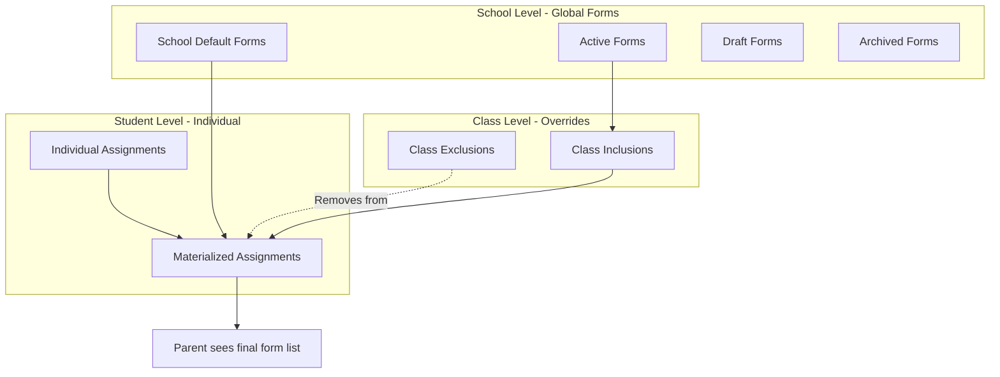

**Assignment Calculation:**
```
Final Forms = School Defaults - Class Exclusions + Class Inclusions + Individual Assignments
```

### 1.2 Form State Definitions

| State | Description | Can Assign to Classes? | Can Assign to Students? | Auto-assigned? |
|-------|-------------|----------------------|----------------------|----------------|
| **School Default** | Default for all new enrollments | Yes (via exclusion only) | Yes | Yes |
| **Active** | Available for assignment | Yes | Yes | No |
| **Draft** | Work in progress | No | No | No |
| **Archive** | Historical/deprecated | No | No | No |

---

## 2. Administrative Workflows

### 2.1 Form Creation & Management

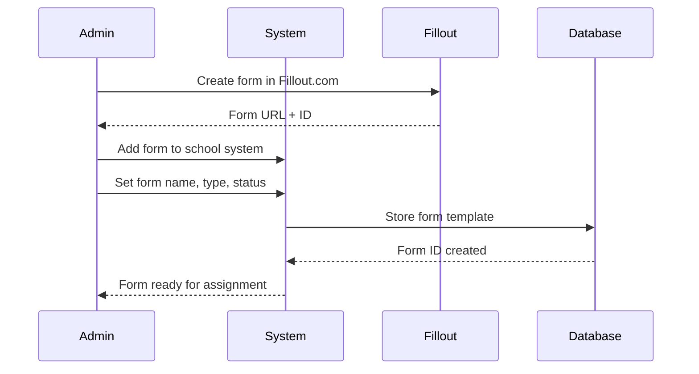

#### Admin Form Management Interface
```typescript
interface FormTemplate {
  id: string;
  schoolId: string;
  formName: string;
  formDescription?: string;
  formType: 'admission' | 'medical' | 'emergency' | 'authorization';
  filloutFormId: string;
  filloutFormUrl: string;
  status: 'active' | 'school_default' | 'draft' | 'archive';
  isRequired: boolean;
  displayOrder: number;
}
```

### 2.2 Class-Level Form Management

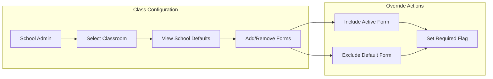

#### Class Override Logic
```sql
-- Example: Toddler class doesn't need "Field Trip Permission" 
-- but needs "Allergy Information" form
INSERT INTO class_form_overrides (classroom_id, form_template_id, action)
VALUES 
  ('toddler-room-1', 'field-trip-form', 'exclude'),
  ('toddler-room-1', 'allergy-info-form', 'include');
```

### 2.3 Individual Student Form Assignment

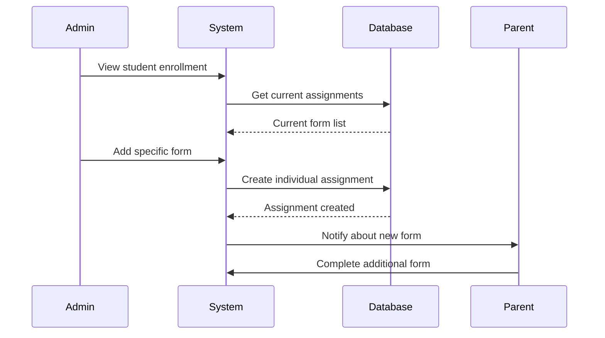

---

## 3. Enrollment Process Workflows

### 3.1 New Student Enrollment with Approval Workflow

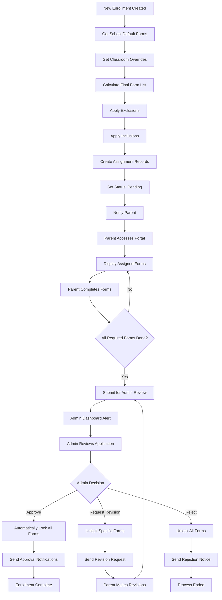

#### Database Function Implementation
```sql
-- Automatic form assignment when enrollment is created
SELECT assign_forms_to_enrollment(
    enrollment_id,
    school_id, 
    child_id,
    classroom_id
);
```

### 3.2 Form Completion Tracking with Admin Approval

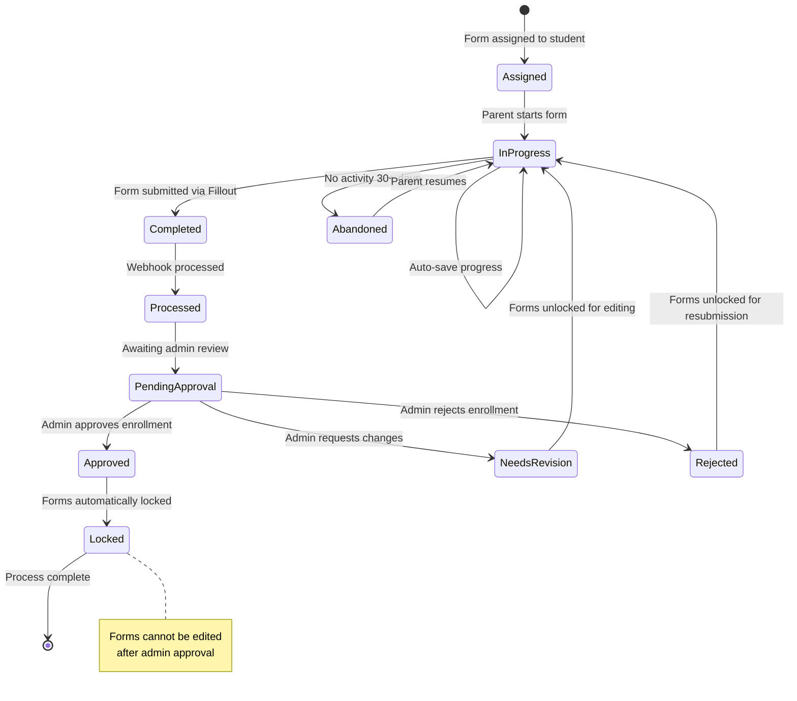

---

## 4. Data Flow & Integration

### 4.1 Fillout Webhook Processing

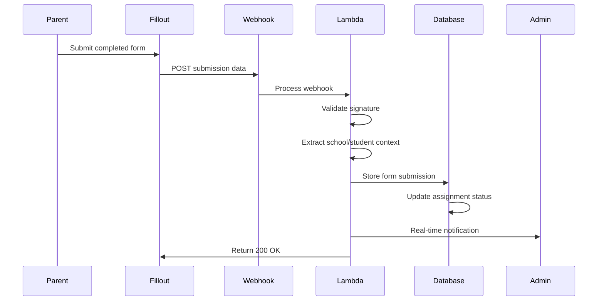

#### Webhook Payload Processing
```rust
// Rust Lambda function for processing Fillout webhooks
pub async fn handle_fillout_webhook(
    event: ApiGatewayProxyRequest,
    _context: Context,
) -> Result<serde_json::Value, Error> {
    let webhook: FilloutWebhook = serde_json::from_str(&event.body)?;
    
    // Extract assignment context from form metadata
    let assignment_id = extract_assignment_id(&webhook.data)?;
    
    // Store submission and mark assignment complete
    store_form_submission(FormSubmission {
        student_form_assignment_id: Some(assignment_id),
        fillout_submission_id: webhook.submission_id,
        form_data: webhook.data,
        submitted_at: webhook.created_at,
    }).await?;
    
    Ok(json!({ "status": "success" }))
}
```

### 4.2 Real-time Updates with Approval Notifications

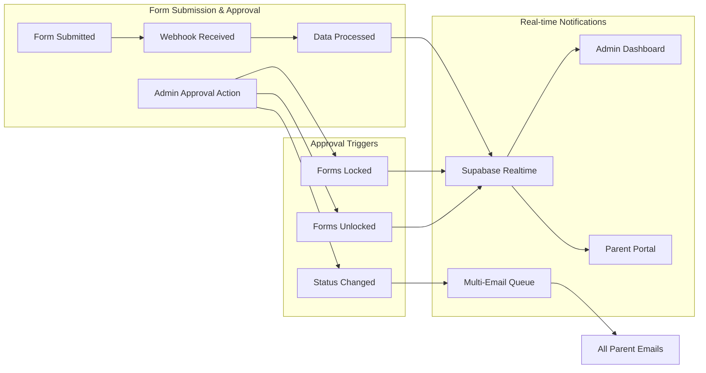

---

## 5. Business Rules & Validation

### 5.1 Form State Transition Rules with Approval Integration

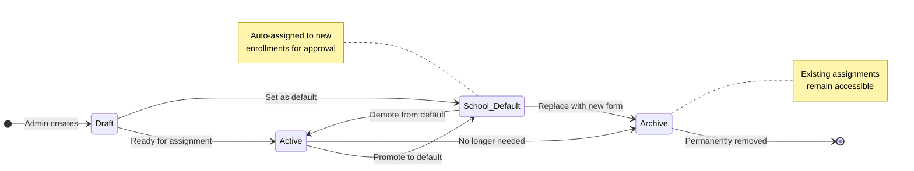

### 5.2 Admin Approval State Transitions

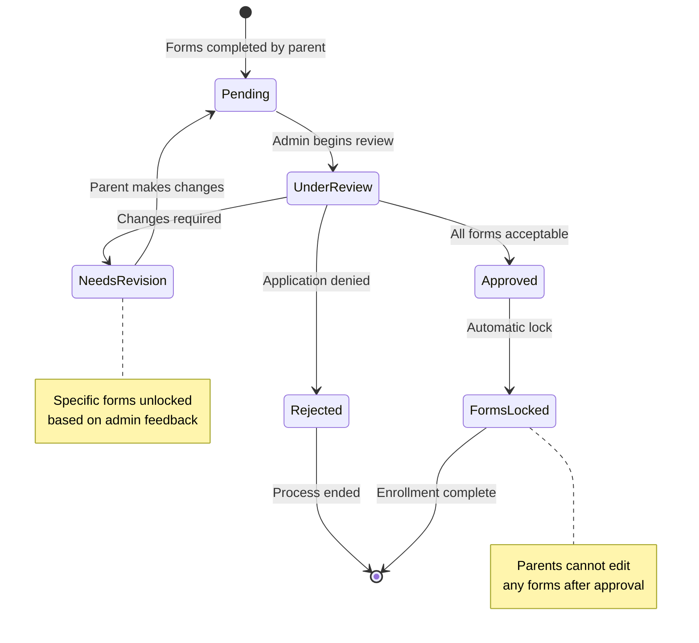

### 5.3 Assignment & Approval Business Rules

| Rule | Description | Enforcement |
|------|-------------|-------------|
| **Unique Assignment** | One assignment per student per form | Database constraint |
| **Archive Protection** | Cannot assign archived forms | Application logic |
| **Draft Restriction** | Cannot assign draft forms | Application logic |
| **Required Inheritance** | Required flag from template unless overridden | Business logic |
| **Class Override Limit** | Cannot exclude what's not default | UI validation |
| **Form Lock Validation** | No submissions allowed when forms locked | API validation |
| **Admin Authorization** | Only admins can approve/reject enrollments | Role-based access control |
| **Complete Before Approval** | All required forms must be done before approval | Database function |
| **Lock Immutability** | Approved forms cannot be unlocked except via revision | Business logic |
| **Notification Delivery** | All parent emails must receive approval notifications | Queue processing |

### 5.3 Data Integrity Constraints

```sql
-- Key database constraints
ALTER TABLE student_form_assignments 
ADD CONSTRAINT unique_enrollment_form 
UNIQUE(enrollment_id, form_template_id);

ALTER TABLE class_form_overrides 
ADD CONSTRAINT unique_classroom_form_override 
UNIQUE(classroom_id, form_template_id);

ALTER TABLE form_templates 
ADD CONSTRAINT check_status_values 
CHECK (status IN ('active', 'school_default', 'draft', 'archive'));
```

---

## 6. Performance Considerations

### 6.1 Query Optimization

**Materialized Assignments Approach:**
- ✅ Fast queries: No complex JOINs needed for parent portal
- ✅ Simple logic: Direct relationship between student and forms
- ✅ Real-time ready: Easy to subscribe to changes
- ⚠️ Storage overhead: ~5000 records for 500 students × 10 forms

### 6.2 Indexing Strategy

```sql
-- Performance indexes for common queries
CREATE INDEX idx_student_assignments_enrollment 
ON student_form_assignments(enrollment_id);

CREATE INDEX idx_form_submissions_assignment 
ON form_submissions(student_form_assignment_id);

CREATE INDEX idx_form_templates_school_status 
ON form_templates(school_id, status);
```

### 6.3 Caching Strategy

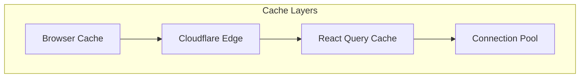

---

## 7. Error Handling & Edge Cases

### 7.1 Common Scenarios

| Scenario | Handling Strategy |
|----------|------------------|
| **Form deleted from Fillout** | Keep assignment, show error to parent |
| **Webhook failure** | Retry with exponential backoff |
| **Duplicate assignment** | Database constraint prevents |
| **Class override conflict** | Include takes precedence over exclude |
| **Parent starts archived form** | Allow completion but warn admin |

### 7.2 Recovery Procedures

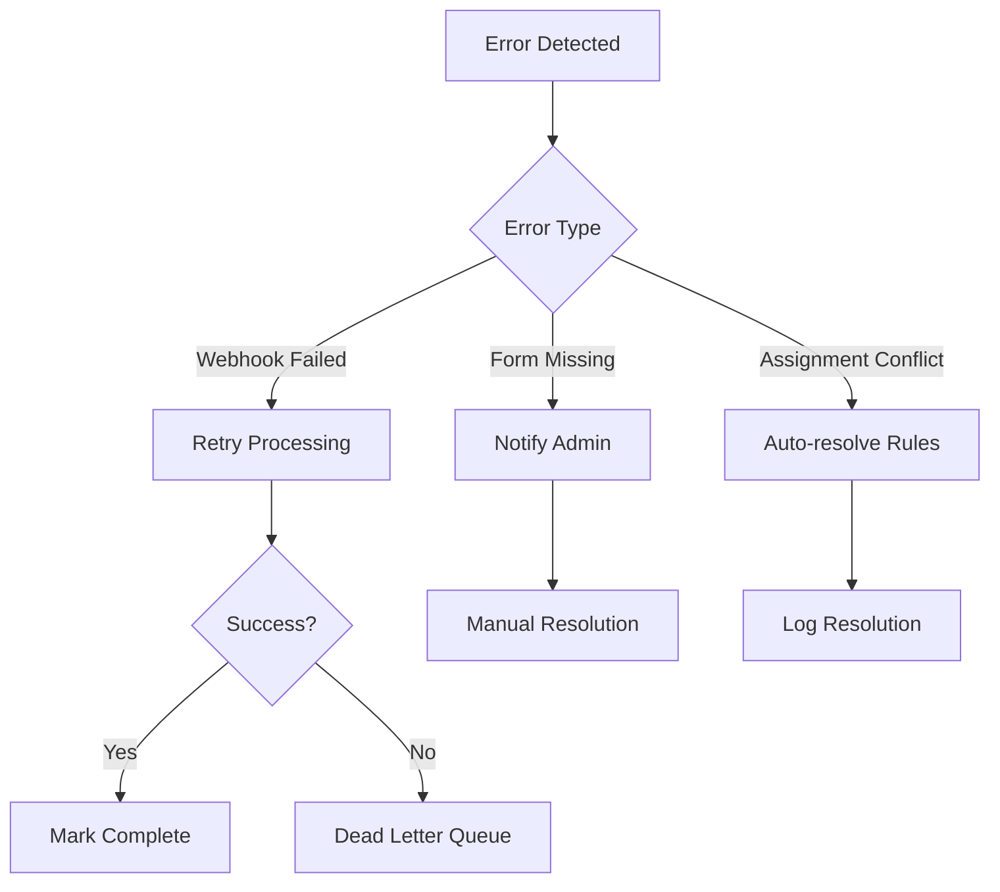

---

## 8. Reporting & Analytics

### 8.1 Admin Dashboard Metrics with Approval Tracking

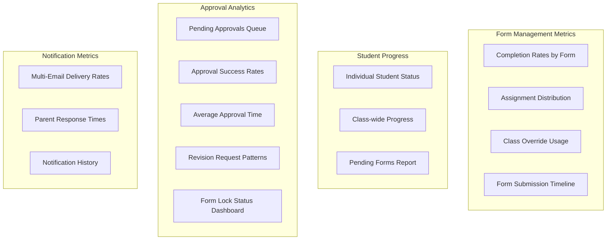

### 8.2 Key Performance Indicators with Approval Metrics

| Metric | Calculation | Target |
|--------|-------------|---------|
| **Form Completion Rate** | Completed / Assigned × 100 | > 90% |
| **Average Completion Time** | Days from assignment to submission | < 7 days |
| **Override Usage** | Classes with overrides / Total classes | < 30% |
| **Individual Assignments** | Individual / Total assignments | < 10% |
| **Approval Processing Time** | Days from submission to admin decision | < 3 days |
| **First-Time Approval Rate** | Approved on first review / Total submissions | > 85% |
| **Form Lock Compliance** | Prevented edits / Lock attempts | 100% |
| **Multi-Email Delivery Rate** | Successful notifications / Total sent | > 99% |
| **Revision Request Rate** | Revision requests / Total reviews | < 15% |

---

## 9. Security & Compliance

### 9.1 Data Access Controls

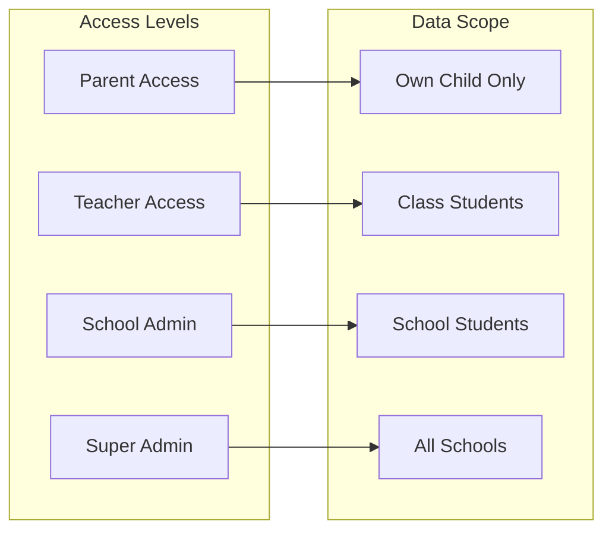

### 9.2 COPPA/FERPA Compliance

- **Data Minimization**: Only collect required form data
- **Parental Consent**: All forms require parent completion
- **Access Controls**: RLS ensures school data isolation
- **Retention Policies**: 7-year retention for enrollment records
- **Audit Trails**: All form assignments and completions logged

---

## 10. Implementation Checklist

### 10.1 Database Setup
- [ ] Create form_templates table with constraints
- [ ] Create class_form_overrides table
- [ ] Create student_form_assignments table
- [ ] Create form_submissions table
- [ ] Add RLS policies for all tables
- [ ] Create helper functions and triggers

### 10.2 Backend Implementation  
- [ ] Implement form template CRUD APIs
- [ ] Implement class override management APIs
- [ ] Implement individual assignment APIs
- [ ] Create automatic assignment function
- [ ] Build Fillout webhook handler
- [ ] Add real-time subscription support

### 10.3 Frontend Implementation
- [ ] Build admin form management interface
- [ ] Create class override management UI
- [ ] Implement individual assignment interface
- [ ] Build parent form completion portal
- [ ] Add real-time progress updates
- [ ] Create reporting dashboard

---

*This comprehensive form management system provides the flexibility and control needed for The Goddard School's diverse enrollment requirements while maintaining security, performance, and compliance standards.*