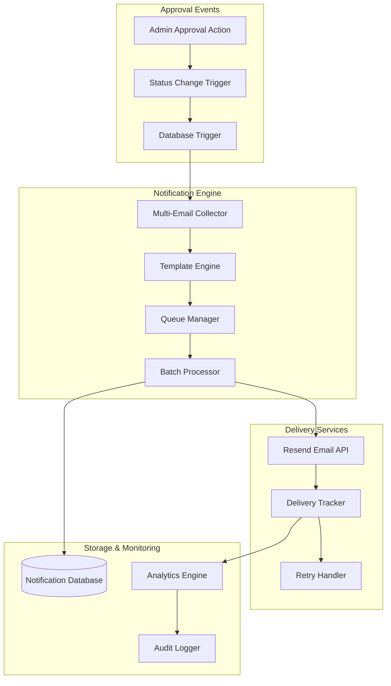
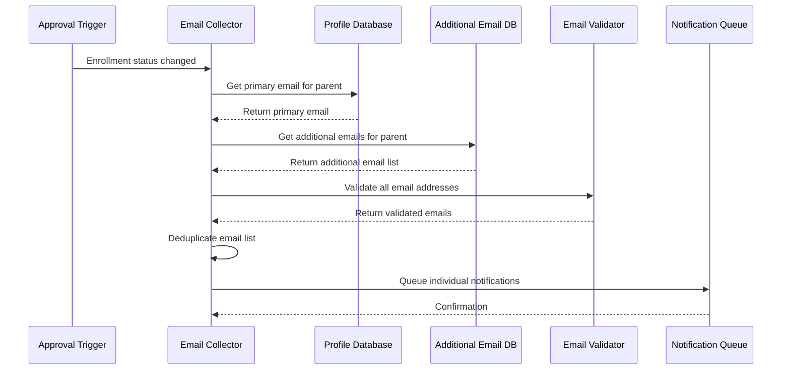
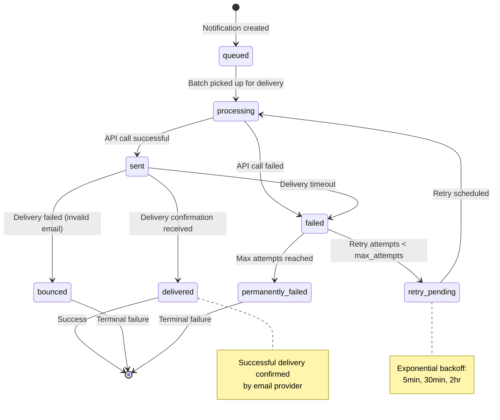

# Notification System Design
## Multi-Email Post-Approval Notification Architecture
### The Goddard School Enrollment Management System

---

## Table of Contents

1. [Executive Summary](#1-executive-summary)
2. [System Architecture](#2-system-architecture)
3. [Multi-Email Collection](#3-multi-email-collection)
4. [Notification Processing Pipeline](#4-notification-processing-pipeline)
5. [Template Management](#5-template-management)
6. [Delivery Tracking & Monitoring](#6-delivery-tracking--monitoring)
7. [Integration Points](#7-integration-points)
8. [Security & Privacy](#8-security--privacy)
9. [Performance Optimization](#9-performance-optimization)
10. [Error Handling & Retry Logic](#10-error-handling--retry-logic)
11. [Monitoring & Analytics](#11-monitoring--analytics)
12. [Implementation Guide](#12-implementation-guide)

---

## 1. Executive Summary

The Notification System Design provides a comprehensive architecture for multi-email post-approval notifications in The Goddard School Enrollment Management System. This system ensures that all relevant parent email addresses receive timely, accurate notifications about enrollment approval status changes, enhancing communication reliability and parent satisfaction.

### 1.1 Key Features

- **Multi-Email Support**: Notifications sent to primary and all verified additional parent emails
- **Real-time Processing**: Immediate notification queuing upon approval status changes
- **Template Management**: Dynamic, customizable notification templates
- **Delivery Tracking**: Comprehensive monitoring of notification delivery success
- **Retry Logic**: Intelligent retry mechanisms for failed deliveries
- **Audit Compliance**: Complete tracking of all notification activities
- **Performance Optimized**: Batch processing and connection pooling for high throughput

### 1.2 Business Benefits

- **Enhanced Communication**: Multiple contact channels reduce missed notifications
- **Improved Parent Experience**: Timely, informative updates throughout enrollment process
- **Operational Efficiency**: Automated notification system reduces manual communication
- **Compliance Assurance**: Complete audit trail for regulatory requirements
- **Reliability**: Redundant email delivery paths increase communication success rates

---

## 2. System Architecture

### 2.1 High-Level Architecture



### 2.2 Component Responsibilities

#### 2.2.1 Multi-Email Collector
- Retrieves primary email from user profiles
- Collects verified additional emails from `parent_additional_emails` table
- Deduplicates email addresses to prevent multiple sends
- Validates email format and deliverability status

#### 2.2.2 Template Engine
- Dynamically generates notification content based on approval action
- Populates template variables with enrollment-specific data
- Supports multi-language templates (future enhancement)
- Maintains template versioning for compliance

#### 2.2.3 Queue Manager
- Manages notification queue with priority levels
- Implements rate limiting to prevent API overuse
- Provides queue monitoring and status reporting
- Supports dead letter queue for failed notifications

#### 2.2.4 Batch Processor
- Groups notifications for efficient API usage
- Implements parallel processing for high throughput
- Manages API rate limits and connection pooling
- Provides batch status reporting and error handling

---

## 3. Multi-Email Collection

### 3.1 Email Collection Workflow



### 3.2 Email Collection Implementation

#### 3.2.1 Database Function
```sql
-- Enhanced function for notification email collection
CREATE OR REPLACE FUNCTION get_enrollment_notification_emails_enhanced(
    p_enrollment_id UUID
) RETURNS TABLE (
    parent_id UUID,
    parent_name TEXT,
    primary_email TEXT,
    additional_emails TEXT[],
    all_notification_emails TEXT[],
    email_count INTEGER
) AS $$
BEGIN
    RETURN QUERY
    SELECT 
        p.id as parent_id,
        CONCAT(p.first_name, ' ', p.last_name) as parent_name,
        p.email as primary_email,
        
        -- Collect additional emails
        COALESCE(
            array_agg(pae.email_address) 
            FILTER (WHERE pae.is_verified = true AND pae.is_active = true AND pae.receive_notifications = true),
            ARRAY[]::TEXT[]
        ) as additional_emails,
        
        -- Combine all emails (primary + additional, deduplicated)
        ARRAY(
            SELECT DISTINCT unnest(
                ARRAY[p.email] || 
                COALESCE(
                    array_agg(pae.email_address) 
                    FILTER (WHERE pae.is_verified = true AND pae.is_active = true AND pae.receive_notifications = true),
                    ARRAY[]::TEXT[]
                )
            )
        ) as all_notification_emails,
        
        -- Count of unique notification emails
        array_length(
            ARRAY(
                SELECT DISTINCT unnest(
                    ARRAY[p.email] || 
                    COALESCE(
                        array_agg(pae.email_address) 
                        FILTER (WHERE pae.is_verified = true AND pae.is_active = true AND pae.receive_notifications = true),
                        ARRAY[]::TEXT[]
                    )
                )
            ), 1
        ) as email_count
        
    FROM enrollments e
    JOIN children c ON e.child_id = c.id
    JOIN profiles p ON c.parent_id = p.id
    LEFT JOIN parent_additional_emails pae ON p.id = pae.parent_id AND pae.school_id = e.school_id
    
    WHERE e.id = p_enrollment_id
    GROUP BY e.id, p.id, p.first_name, p.last_name, p.email;
END;
$$ LANGUAGE plpgsql;
```

#### 3.2.2 Rust Implementation
```rust
#[derive(Debug, Clone)]
pub struct NotificationEmailCollection {
    pub parent_id: Uuid,
    pub parent_name: String,
    pub primary_email: String,
    pub additional_emails: Vec<String>,
    pub all_emails: Vec<String>,
    pub email_count: usize,
}

pub async fn collect_notification_emails(
    db: &DatabaseClient,
    enrollment_id: Uuid,
) -> Result<NotificationEmailCollection> {
    let query = "SELECT * FROM get_enrollment_notification_emails_enhanced($1)";
    
    let row = db
        .query_one(query, &[&enrollment_id])
        .await
        .map_err(|e| NotificationError::DatabaseError(e.to_string()))?;
        
    let primary_email: String = row.get("primary_email");
    let additional_emails: Vec<String> = row.get("additional_emails");
    let all_emails: Vec<String> = row.get("all_notification_emails");
    
    // Validate all email addresses
    let validated_emails = validate_email_list(&all_emails).await?;
    
    Ok(NotificationEmailCollection {
        parent_id: row.get("parent_id"),
        parent_name: row.get("parent_name"),
        primary_email,
        additional_emails,
        all_emails: validated_emails,
        email_count: row.get("email_count"),
    })
}
```

---

## 4. Notification Processing Pipeline

### 4.1 Pipeline Architecture

```mermaid
graph LR
    subgraph "Input Stage"
        TRIGGER[Approval Event Trigger]
        DATA_COLLECTION[Data Collection]
    end
    
    subgraph "Processing Stage"
        EMAIL_COLLECT[Email Collection]
        TEMPLATE_RENDER[Template Rendering]
        QUEUE_CREATION[Queue Item Creation]
    end
    
    subgraph "Delivery Stage"
        BATCH_CREATION[Batch Creation]
        API_DELIVERY[API Delivery]
        STATUS_UPDATE[Status Updates]
    end
    
    subgraph "Monitoring Stage"
        DELIVERY_TRACK[Delivery Tracking]
        RETRY_LOGIC[Retry Processing]
        ANALYTICS[Analytics Collection]
    end
    
    TRIGGER --> DATA_COLLECTION
    DATA_COLLECTION --> EMAIL_COLLECT
    EMAIL_COLLECT --> TEMPLATE_RENDER
    TEMPLATE_RENDER --> QUEUE_CREATION
    
    QUEUE_CREATION --> BATCH_CREATION
    BATCH_CREATION --> API_DELIVERY
    API_DELIVERY --> STATUS_UPDATE
    
    STATUS_UPDATE --> DELIVERY_TRACK
    DELIVERY_TRACK --> RETRY_LOGIC
    RETRY_LOGIC --> ANALYTICS
```



### 4.2 Notification Queue Schema

#### 4.2.1 Database Tables
```sql
-- Main notification queue table
CREATE TABLE notification_queue (
    id UUID PRIMARY KEY DEFAULT gen_random_uuid(),
    school_id UUID REFERENCES schools(id) NOT NULL,
    enrollment_id UUID REFERENCES enrollments(id) NOT NULL,
    parent_id UUID REFERENCES profiles(id) NOT NULL,
    
    -- Notification details
    notification_type VARCHAR(50) NOT NULL, -- 'enrollment_approved', 'enrollment_rejected', 'needs_revision'
    recipient_email VARCHAR(255) NOT NULL,
    recipient_type VARCHAR(20) DEFAULT 'parent',
    
    -- Message content
    subject TEXT NOT NULL,
    message_body TEXT NOT NULL,
    template_id VARCHAR(50),
    template_version INTEGER DEFAULT 1,
    
    -- Processing status
    status VARCHAR(20) DEFAULT 'queued', -- 'queued', 'processing', 'sent', 'delivered', 'failed', 'cancelled'
    priority INTEGER DEFAULT 5, -- 1 (highest) to 10 (lowest)
    
    -- Delivery tracking
    external_message_id VARCHAR(100), -- Resend message ID
    delivery_attempts INTEGER DEFAULT 0,
    max_retry_attempts INTEGER DEFAULT 3,
    last_attempt_at TIMESTAMP,
    delivered_at TIMESTAMP,
    failed_at TIMESTAMP,
    failure_reason TEXT,
    
    -- Metadata
    metadata JSONB DEFAULT '{}',
    created_at TIMESTAMP DEFAULT NOW(),
    updated_at TIMESTAMP DEFAULT NOW(),
    
    -- Indexes for performance
    CONSTRAINT unique_notification_per_email_per_event UNIQUE(enrollment_id, notification_type, recipient_email)
);

-- Indexes for efficient querying
CREATE INDEX idx_notification_queue_status ON notification_queue(status);
CREATE INDEX idx_notification_queue_priority ON notification_queue(priority, created_at);
CREATE INDEX idx_notification_queue_school ON notification_queue(school_id);
CREATE INDEX idx_notification_queue_enrollment ON notification_queue(enrollment_id);
CREATE INDEX idx_notification_queue_retry ON notification_queue(status, delivery_attempts, last_attempt_at) 
    WHERE status = 'failed' AND delivery_attempts < max_retry_attempts;
```

#### 4.2.2 Batch Processing Table
```sql
-- Batch tracking for efficient API usage
CREATE TABLE notification_batches (
    id UUID PRIMARY KEY DEFAULT gen_random_uuid(),
    school_id UUID REFERENCES schools(id) NOT NULL,
    batch_type VARCHAR(50) NOT NULL,
    
    -- Batch details
    total_notifications INTEGER NOT NULL,
    processed_notifications INTEGER DEFAULT 0,
    successful_notifications INTEGER DEFAULT 0,
    failed_notifications INTEGER DEFAULT 0,
    
    -- Processing status
    status VARCHAR(20) DEFAULT 'pending', -- 'pending', 'processing', 'completed', 'failed'
    started_at TIMESTAMP,
    completed_at TIMESTAMP,
    
    -- Performance metrics
    processing_time_ms INTEGER,
    api_calls_made INTEGER,
    
    -- Error tracking
    error_summary JSONB DEFAULT '{}',
    
    created_at TIMESTAMP DEFAULT NOW()
);
```

### 4.3 Queue Processing Implementation

#### 4.3.1 Queue Manager
```rust
pub struct NotificationQueueManager {
    db_client: Arc<DatabaseClient>,
    email_client: Arc<ResendClient>,
    template_engine: Arc<TemplateEngine>,
    batch_size: usize,
}

impl NotificationQueueManager {
    pub async fn process_approval_notification(
        &self,
        enrollment_id: Uuid,
        approval_event: ApprovalEvent,
    ) -> Result<NotificationBatch> {
        // 1. Collect notification emails
        let email_collection = collect_notification_emails(&self.db_client, enrollment_id).await?;
        
        // 2. Generate notification content
        let template_data = self.build_template_data(enrollment_id, &approval_event).await?;
        let rendered_content = self.template_engine.render(&approval_event.template_id(), &template_data)?;
        
        // 3. Create queue items for each email
        let mut queue_items = Vec::new();
        for email in &email_collection.all_emails {
            let queue_item = NotificationQueueItem {
                id: Uuid::new_v4(),
                enrollment_id,
                parent_id: email_collection.parent_id,
                notification_type: approval_event.notification_type(),
                recipient_email: email.clone(),
                subject: rendered_content.subject.clone(),
                message_body: rendered_content.body.clone(),
                template_id: approval_event.template_id(),
                priority: approval_event.priority(),
                metadata: json!({
                    "approval_action": approval_event.action,
                    "admin_id": approval_event.admin_id,
                    "parent_name": email_collection.parent_name,
                }),
                ..Default::default()
            };
            queue_items.push(queue_item);
        }
        
        // 4. Insert queue items into database
        self.insert_queue_items(&queue_items).await?;
        
        // 5. Process immediately (or schedule for batch processing)
        self.process_queue_batch(queue_items).await
    }
    
    pub async fn process_queue_batch(&self, queue_items: Vec<NotificationQueueItem>) -> Result<NotificationBatch> {
        let batch_id = Uuid::new_v4();
        let batch_start = Instant::now();
        
        // Create batch record
        self.create_batch_record(batch_id, &queue_items).await?;
        
        // Process items in parallel batches
        let mut successful = 0;
        let mut failed = 0;
        let mut api_calls = 0;
        
        for chunk in queue_items.chunks(self.batch_size) {
            let batch_result = self.send_email_batch(chunk).await;
            
            match batch_result {
                Ok(result) => {
                    successful += result.successful_count;
                    failed += result.failed_count;
                    api_calls += result.api_calls;
                    
                    // Update queue item statuses
                    self.update_queue_item_statuses(&result.item_results).await?;
                }
                Err(e) => {
                    // Mark entire chunk as failed
                    failed += chunk.len();
                    self.mark_batch_failed(chunk, &e.to_string()).await?;
                }
            }
        }
        
        let processing_time = batch_start.elapsed();
        
        // Update batch completion
        self.complete_batch_record(
            batch_id,
            successful,
            failed,
            api_calls,
            processing_time.as_millis() as i32,
        ).await?;
        
        Ok(NotificationBatch {
            id: batch_id,
            total_items: queue_items.len(),
            successful_items: successful,
            failed_items: failed,
            processing_time_ms: processing_time.as_millis(),
            api_calls_made: api_calls,
        })
    }
}
```

---

## 5. Template Management

### 5.1 Template Architecture

#### 5.1.1 Template Storage Schema
```sql
-- Notification templates table
CREATE TABLE notification_templates (
    id VARCHAR(50) PRIMARY KEY,
    template_name VARCHAR(100) NOT NULL,
    template_type VARCHAR(50) NOT NULL, -- 'approval', 'rejection', 'revision_request'
    
    -- Template content
    subject_template TEXT NOT NULL,
    body_template TEXT NOT NULL,
    html_template TEXT,
    
    -- Template metadata
    version INTEGER DEFAULT 1,
    language VARCHAR(5) DEFAULT 'en',
    is_active BOOLEAN DEFAULT TRUE,
    
    -- Template variables (JSON schema)
    required_variables JSONB DEFAULT '[]',
    optional_variables JSONB DEFAULT '[]',
    
    -- Versioning and audit
    created_by UUID REFERENCES profiles(id),
    updated_by UUID REFERENCES profiles(id),
    created_at TIMESTAMP DEFAULT NOW(),
    updated_at TIMESTAMP DEFAULT NOW(),
    
    CONSTRAINT unique_active_template UNIQUE(template_type, language, is_active) 
        DEFERRABLE INITIALLY DEFERRED
);
```

#### 5.1.2 Template Examples

##### Approval Template
```sql
INSERT INTO notification_templates (
    id, template_name, template_type, 
    subject_template, body_template, html_template,
    required_variables, optional_variables
) VALUES (
    'approval_v1',
    'Enrollment Approval Notification',
    'approval',
    
    -- Subject template
    '🎉 Enrollment Approved - Welcome to {{school_name}}!',
    
    -- Plain text body template
    'Dear {{parent_name}},

Congratulations! Your enrollment application for {{child_name}} has been approved.

📋 Application Details:
• Child: {{child_name}}
• School: {{school_name}}
• Classroom: {{classroom_name}}
• Start Date: {{start_date}}
• Approved by: {{admin_name}}
• Approval Date: {{approval_date}}

✅ Next Steps:
• All forms are now locked and cannot be edited
• Your child''s enrollment is complete
• Watch for welcome information from your assigned classroom

If you have any questions, please contact us at {{school_contact_email}} or call {{school_phone}}.

Welcome to the {{school_name}} family!

Best regards,
The {{school_name}} Team',

    -- HTML body template
    '<!DOCTYPE html>
<html>
<head>
    <style>
        .container { max-width: 600px; margin: 0 auto; font-family: Arial, sans-serif; }
        .header { background-color: #2563eb; color: white; padding: 20px; text-align: center; }
        .content { padding: 20px; }
        .highlight { background-color: #f0f9ff; padding: 15px; border-radius: 5px; margin: 15px 0; }
        .footer { background-color: #f8fafc; padding: 15px; text-align: center; }
    </style>
</head>
<body>
    <div class="container">
        <div class="header">
            <h1>🎉 Enrollment Approved!</h1>
        </div>
        <div class="content">
            <p>Dear {{parent_name}},</p>
            
            <p>Congratulations! Your enrollment application for <strong>{{child_name}}</strong> has been approved.</p>
            
            <div class="highlight">
                <h3>📋 Application Details:</h3>
                <ul>
                    <li><strong>Child:</strong> {{child_name}}</li>
                    <li><strong>School:</strong> {{school_name}}</li>
                    <li><strong>Classroom:</strong> {{classroom_name}}</li>
                    <li><strong>Start Date:</strong> {{start_date}}</li>
                    <li><strong>Approved by:</strong> {{admin_name}}</li>
                    <li><strong>Approval Date:</strong> {{approval_date}}</li>
                </ul>
            </div>
            
            <h3>✅ Next Steps:</h3>
            <ul>
                <li>All forms are now locked and cannot be edited</li>
                <li>Your child''s enrollment is complete</li>
                <li>Watch for welcome information from your assigned classroom</li>
            </ul>
            
            <p>If you have any questions, please contact us at <a href="mailto:{{school_contact_email}}">{{school_contact_email}}</a> or call {{school_phone}}.</p>
            
            <p><strong>Welcome to the {{school_name}} family!</strong></p>
        </div>
        <div class="footer">
            <p>Best regards,<br>The {{school_name}} Team</p>
        </div>
    </div>
</body>
</html>',

    -- Required variables
    '["parent_name", "child_name", "school_name", "classroom_name", "start_date", "admin_name", "approval_date", "school_contact_email", "school_phone"]',
    
    -- Optional variables
    '["approval_notes", "special_instructions"]'
);
```

### 5.2 Template Engine Implementation

#### 5.2.1 Template Renderer
```rust
use handlebars::Handlebars;
use serde_json::{json, Value};

pub struct TemplateEngine {
    handlebars: Handlebars<'static>,
    db_client: Arc<DatabaseClient>,
}

impl TemplateEngine {
    pub fn new(db_client: Arc<DatabaseClient>) -> Self {
        let mut handlebars = Handlebars::new();
        
        // Register custom helpers
        handlebars.register_helper("format_date", Box::new(format_date_helper));
        handlebars.register_helper("format_phone", Box::new(format_phone_helper));
        handlebars.register_helper("capitalize", Box::new(capitalize_helper));
        
        Self {
            handlebars,
            db_client,
        }
    }
    
    pub async fn render_notification(
        &self,
        template_id: &str,
        data: &Value,
    ) -> Result<RenderedNotification> {
        // Get template from database
        let template = self.get_template(template_id).await?;
        
        // Validate required variables
        self.validate_template_data(&template, data)?;
        
        // Render subject and body
        let subject = self.handlebars.render_template(&template.subject_template, data)?;
        let text_body = self.handlebars.render_template(&template.body_template, data)?;
        let html_body = if let Some(html_template) = &template.html_template {
            Some(self.handlebars.render_template(html_template, data)?)
        } else {
            None
        };
        
        Ok(RenderedNotification {
            template_id: template.id,
            template_version: template.version,
            subject,
            text_body,
            html_body,
            rendered_at: Utc::now(),
        })
    }
    
    async fn get_template(&self, template_id: &str) -> Result<NotificationTemplate> {
        let query = "SELECT * FROM notification_templates WHERE id = $1 AND is_active = true";
        
        let row = self.db_client
            .query_one(query, &[&template_id])
            .await
            .map_err(|_| TemplateError::TemplateNotFound(template_id.to_string()))?;
            
        Ok(NotificationTemplate {
            id: row.get("id"),
            template_name: row.get("template_name"),
            template_type: row.get("template_type"),
            subject_template: row.get("subject_template"),
            body_template: row.get("body_template"),
            html_template: row.get("html_template"),
            version: row.get("version"),
            required_variables: row.get("required_variables"),
            optional_variables: row.get("optional_variables"),
        })
    }
}

// Custom Handlebars helpers
fn format_date_helper(
    h: &handlebars::Helper,
    _: &handlebars::Handlebars,
    _: &handlebars::Context,
    _: &mut handlebars::RenderContext,
    out: &mut dyn handlebars::Output,
) -> handlebars::HelperResult {
    let date_str = h.param(0).and_then(|v| v.value().as_str()).unwrap_or("");
    let format = h.param(1).and_then(|v| v.value().as_str()).unwrap_or("%B %d, %Y");
    
    if let Ok(parsed_date) = chrono::DateTime::parse_from_rfc3339(date_str) {
        let formatted = parsed_date.format(format).to_string();
        out.write(&formatted)?;
    } else {
        out.write(date_str)?;
    }
    
    Ok(())
}
```

---

## 6. Delivery Tracking & Monitoring

### 6.1 Delivery Status Workflow



### 6.2 Delivery Tracking Implementation

#### 6.2.1 Webhook Handling
```rust
// Webhook endpoint for Resend delivery notifications
#[derive(Deserialize)]
pub struct ResendWebhookPayload {
    #[serde(rename = "type")]
    pub event_type: String,
    pub created_at: String,
    pub data: ResendEventData,
}

#[derive(Deserialize)]
pub struct ResendEventData {
    pub message_id: String,
    pub to: Vec<String>,
    pub subject: String,
    pub tags: Option<Vec<ResendTag>>,
    pub bounce: Option<BounceData>,
    pub click: Option<ClickData>,
    pub open: Option<OpenData>,
}

pub async fn handle_resend_webhook(
    payload: ResendWebhookPayload,
    db_client: &DatabaseClient,
) -> Result<()> {
    match payload.event_type.as_str() {
        "email.sent" => {
            update_notification_status(
                db_client,
                &payload.data.message_id,
                NotificationStatus::Sent,
                None,
            ).await?;
        }
        
        "email.delivered" => {
            update_notification_status(
                db_client,
                &payload.data.message_id,
                NotificationStatus::Delivered,
                Some(Utc::now()),
            ).await?;
        }
        
        "email.delivery_delayed" => {
            // Log delay but don't change status yet
            log_delivery_event(
                db_client,
                &payload.data.message_id,
                "delivery_delayed",
                "Email delivery delayed by provider",
            ).await?;
        }
        
        "email.bounced" => {
            let bounce_reason = payload.data.bounce
                .map(|b| b.bounce_type)
                .unwrap_or_else(|| "Unknown bounce".to_string());
                
            update_notification_status(
                db_client,
                &payload.data.message_id,
                NotificationStatus::Bounced,
                None,
            ).await?;
            
            // Mark email as invalid if hard bounce
            if bounce_reason.contains("permanent") {
                mark_email_as_invalid(db_client, &payload.data.to[0]).await?;
            }
        }
        
        "email.opened" => {
            log_delivery_event(
                db_client,
                &payload.data.message_id,
                "opened",
                "Email opened by recipient",
            ).await?;
        }
        
        "email.clicked" => {
            if let Some(click_data) = payload.data.click {
                log_delivery_event(
                    db_client,
                    &payload.data.message_id,
                    "clicked",
                    &format!("Clicked link: {}", click_data.url),
                ).await?;
            }
        }
        
        _ => {
            warn!("Unknown webhook event type: {}", payload.event_type);
        }
    }
    
    Ok(())
}
```

#### 6.2.2 Delivery Analytics
```sql
-- Delivery analytics view
CREATE VIEW notification_delivery_analytics AS
SELECT 
    DATE_TRUNC('day', created_at) as date,
    notification_type,
    school_id,
    
    -- Delivery metrics
    COUNT(*) as total_notifications,
    COUNT(*) FILTER (WHERE status = 'delivered') as delivered_count,
    COUNT(*) FILTER (WHERE status = 'bounced') as bounced_count,
    COUNT(*) FILTER (WHERE status = 'failed') as failed_count,
    COUNT(*) FILTER (WHERE status = 'permanently_failed') as permanently_failed_count,
    
    -- Success rates
    ROUND(
        (COUNT(*) FILTER (WHERE status = 'delivered')::DECIMAL / COUNT(*)) * 100, 2
    ) as delivery_rate_percent,
    
    -- Timing metrics
    AVG(
        EXTRACT(EPOCH FROM (delivered_at - created_at))
    ) FILTER (WHERE delivered_at IS NOT NULL) as avg_delivery_time_seconds,
    
    -- Retry statistics
    AVG(delivery_attempts) as avg_delivery_attempts,
    MAX(delivery_attempts) as max_delivery_attempts

FROM notification_queue
GROUP BY DATE_TRUNC('day', created_at), notification_type, school_id
ORDER BY date DESC, school_id;
```

---

## 7. Integration Points

### 7.1 Database Integration

#### 7.1.1 Enrollment Status Trigger
```sql
-- Enhanced trigger function for approval notifications with multi-email support
CREATE OR REPLACE FUNCTION trigger_enrollment_approval_notification_enhanced()
RETURNS TRIGGER AS $$
DECLARE
    notification_emails RECORD;
    email_addr TEXT;
    notification_type VARCHAR(50);
    notification_subject TEXT;
    notification_body TEXT;
BEGIN
    -- Only trigger on approval status changes
    IF TG_OP = 'UPDATE' AND OLD.admin_approval_status != NEW.admin_approval_status THEN
        
        -- Get all notification emails for this enrollment
        FOR notification_emails IN 
            SELECT * FROM get_enrollment_notification_emails_enhanced(NEW.id)
        LOOP
            -- Determine notification type and content
            CASE NEW.admin_approval_status
                WHEN 'approved' THEN
                    notification_type := 'enrollment_approved';
                    notification_subject := '🎉 Enrollment Approved - Welcome to ' || 
                        (SELECT name FROM schools WHERE id = NEW.school_id) || '!';
                WHEN 'rejected' THEN
                    notification_type := 'enrollment_rejected';
                    notification_subject := 'Enrollment Application Update Required';
                WHEN 'needs_revision' THEN
                    notification_type := 'enrollment_needs_revision';
                    notification_subject := 'Action Required - Enrollment Application Update Needed';
                ELSE
                    notification_type := 'enrollment_status_changed';
                    notification_subject := 'Enrollment Status Update';
            END CASE;
            
            -- Queue notification for each email address
            FOREACH email_addr IN ARRAY notification_emails.all_notification_emails
            LOOP
                INSERT INTO notification_queue (
                    school_id,
                    enrollment_id,
                    parent_id,
                    notification_type,
                    recipient_email,
                    recipient_type,
                    subject,
                    message_body,
                    template_id,
                    priority,
                    metadata
                ) VALUES (
                    NEW.school_id,
                    NEW.id,
                    notification_emails.parent_id,
                    notification_type,
                    email_addr,
                    'parent',
                    notification_subject,
                    'Template will be rendered during processing',
                    notification_type || '_v1',
                    CASE 
                        WHEN NEW.admin_approval_status = 'approved' THEN 1 -- High priority
                        WHEN NEW.admin_approval_status = 'needs_revision' THEN 2
                        ELSE 3
                    END,
                    jsonb_build_object(
                        'approval_status', NEW.admin_approval_status,
                        'previous_status', OLD.admin_approval_status,
                        'approved_by', NEW.approved_by,
                        'approval_notes', NEW.approval_notes,
                        'forms_locked', NEW.forms_locked_at IS NOT NULL,
                        'parent_name', notification_emails.parent_name,
                        'email_count', notification_emails.email_count
                    )
                );
            END LOOP;
        END LOOP;
        
        -- Trigger immediate processing (via Supabase function or external service)
        PERFORM pg_notify('notification_queue_updated', NEW.id::text);
        
    END IF;
    
    RETURN NEW;
END;
$$ LANGUAGE plpgsql;

-- Update the trigger
DROP TRIGGER IF EXISTS trigger_enrollment_approval_notification ON enrollments;
CREATE TRIGGER trigger_enrollment_approval_notification_enhanced
    AFTER UPDATE ON enrollments
    FOR EACH ROW
    EXECUTE FUNCTION trigger_enrollment_approval_notification_enhanced();
```

### 7.2 Lambda Function Integration

#### 7.2.1 Queue Processing Lambda
```rust
// AWS Lambda function for processing notification queue
use aws_lambda_events::sqs::SqsEvent;
use lambda_runtime::{Error, LambdaEvent, Runtime};

#[tokio::main]
async fn main() -> Result<(), Error> {
    let func = lambda_runtime::service_fn(handler);
    lambda_runtime::run(func).await
}

async fn handler(event: LambdaEvent<SqsEvent>) -> Result<(), Error> {
    let db_client = create_database_client().await?;
    let notification_service = NotificationService::new(db_client);
    
    for record in event.payload.records {
        if let Some(body) = record.body {
            if let Ok(enrollment_id) = serde_json::from_str::<Uuid>(&body) {
                match notification_service.process_enrollment_notifications(enrollment_id).await {
                    Ok(batch_result) => {
                        info!(
                            "Processed notifications for enrollment {}: {} sent, {} failed",
                            enrollment_id,
                            batch_result.successful_items,
                            batch_result.failed_items
                        );
                    }
                    Err(e) => {
                        error!(
                            "Failed to process notifications for enrollment {}: {}",
                            enrollment_id, e
                        );
                        
                        // Could implement dead letter queue logic here
                        return Err(e.into());
                    }
                }
            }
        }
    }
    
    Ok(())
}
```

### 7.3 Real-time Integration

#### 7.3.1 Supabase Realtime Integration
```typescript
// Frontend real-time subscription for notification status
const supabase = createClient(supabaseUrl, supabaseAnonKey);

// Subscribe to enrollment approval status changes
const subscribeToApprovalUpdates = (enrollmentId: string) => {
  return supabase
    .channel(`enrollment:${enrollmentId}`)
    .on(
      'postgres_changes',
      {
        event: 'UPDATE',
        schema: 'public',
        table: 'enrollments',
        filter: `id=eq.${enrollmentId}`,
      },
      (payload) => {
        const { old: oldRecord, new: newRecord } = payload;
        
        if (oldRecord.admin_approval_status !== newRecord.admin_approval_status) {
          // Update UI with new approval status
          updateApprovalStatus(newRecord.admin_approval_status);
          
          // Show notification banner
          showStatusBanner({
            status: newRecord.admin_approval_status,
            message: getStatusMessage(newRecord.admin_approval_status),
            formsLocked: newRecord.forms_locked_at !== null,
          });
        }
      }
    )
    .on(
      'postgres_changes',
      {
        event: 'INSERT',
        schema: 'public',
        table: 'notification_queue',
        filter: `enrollment_id=eq.${enrollmentId}`,
      },
      (payload) => {
        // Show that notifications are being sent
        showNotificationStatus({
          type: 'sending',
          message: 'Sending notifications to all your email addresses...',
        });
      }
    )
    .subscribe();
};
```

---

## 8. Security & Privacy

### 8.1 Data Protection

#### 8.1.1 Email Address Security
- **Encryption at Rest**: All email addresses encrypted using AES-256
- **Access Control**: Email addresses only accessible by authorized school staff
- **Audit Logging**: All email access and modifications logged
- **Data Minimization**: Only collect necessary email information
- **Retention Policies**: Email addresses purged according to school data retention policies

#### 8.1.2 Notification Content Security
```rust
// Secure template rendering with data sanitization
pub fn sanitize_template_data(data: &mut Value) -> Result<()> {
    if let Value::Object(map) = data {
        for (key, value) in map.iter_mut() {
            match value {
                Value::String(s) => {
                    // Sanitize HTML and potentially harmful content
                    *s = html_escape::encode_text(s).to_string();
                    
                    // Remove any script tags or dangerous content
                    *s = remove_dangerous_content(s);
                }
                Value::Object(_) => {
                    // Recursively sanitize nested objects
                    sanitize_template_data(value)?;
                }
                _ => {} // Numbers, booleans, etc. are safe
            }
        }
    }
    Ok(())
}

fn remove_dangerous_content(input: &str) -> String {
    // Remove script tags, style tags, and other potentially dangerous content
    let dangerous_patterns = [
        r"<script[^>]*>.*?</script>",
        r"<style[^>]*>.*?</style>",
        r"javascript:",
        r"data:text/html",
        r"vbscript:",
    ];
    
    let mut clean_content = input.to_string();
    for pattern in &dangerous_patterns {
        if let Ok(regex) = Regex::new(pattern) {
            clean_content = regex.replace_all(&clean_content, "").to_string();
        }
    }
    
    clean_content
}
```

### 8.2 Compliance

#### 8.2.1 COPPA/FERPA Compliance
- **Parental Consent**: All additional email addresses require parental verification
- **Educational Purpose**: Notifications limited to enrollment-related communications
- **Data Subject Rights**: Parents can remove additional email addresses at any time
- **Audit Trail**: Complete logging of all notification activities for compliance review

#### 8.2.2 CAN-SPAM Compliance
```rust
// Ensure all notifications include required CAN-SPAM elements
pub fn add_compliance_footer(
    email_body: &str,
    school_info: &SchoolInfo,
    unsubscribe_url: &str,
) -> String {
    let compliance_footer = format!(
        r#"

---

This email was sent by {school_name} regarding your child's enrollment.

School Address:
{school_address}
{school_city}, {school_state} {school_zip}

You are receiving this email because you have an active enrollment application with our school.
If you believe you received this email in error, please contact us at {contact_email}.

To manage your email preferences or remove additional email addresses:
{unsubscribe_url}
"#,
        school_name = school_info.name,
        school_address = school_info.address,
        school_city = school_info.city,
        school_state = school_info.state,
        school_zip = school_info.zip_code,
        contact_email = school_info.contact_email,
        unsubscribe_url = unsubscribe_url
    );
    
    format!("{}{}", email_body, compliance_footer)
}
```

---

## 9. Performance Optimization

### 9.1 Batch Processing Optimization

#### 9.1.1 Intelligent Batching
```rust
pub struct BatchOptimizer {
    max_batch_size: usize,
    min_batch_size: usize,
    batch_timeout: Duration,
    rate_limit_per_second: u32,
}

impl BatchOptimizer {
    pub async fn optimize_batch_processing(&self) -> Result<()> {
        loop {
            // Get pending notifications with priority ordering
            let pending_notifications = self.get_pending_notifications().await?;
            
            if pending_notifications.is_empty() {
                // No pending notifications, sleep and check again
                tokio::time::sleep(Duration::from_secs(5)).await;
                continue;
            }
            
            // Group by priority and school for optimal batching
            let batches = self.create_optimal_batches(&pending_notifications);
            
            // Process batches with rate limiting
            for batch in batches {
                self.process_batch_with_rate_limiting(batch).await?;
            }
        }
    }
    
    fn create_optimal_batches(
        &self,
        notifications: &[NotificationQueueItem],
    ) -> Vec<Vec<NotificationQueueItem>> {
        let mut batches = Vec::new();
        let mut current_batch = Vec::new();
        let mut current_school_id = None;
        
        for notification in notifications {
            // Start new batch if school changes or batch is full
            if current_school_id != Some(notification.school_id) 
                || current_batch.len() >= self.max_batch_size {
                
                if !current_batch.is_empty() {
                    batches.push(current_batch);
                    current_batch = Vec::new();
                }
                current_school_id = Some(notification.school_id);
            }
            
            current_batch.push(notification.clone());
        }
        
        // Add final batch if not empty
        if !current_batch.is_empty() {
            batches.push(current_batch);
        }
        
        batches
    }
    
    async fn process_batch_with_rate_limiting(
        &self,
        batch: Vec<NotificationQueueItem>,
    ) -> Result<()> {
        let batch_size = batch.len();
        let processing_time = batch_size as f64 / self.rate_limit_per_second as f64;
        
        // Process the batch
        let start_time = Instant::now();
        let result = self.send_notification_batch(&batch).await?;
        let actual_processing_time = start_time.elapsed();
        
        // If we processed faster than rate limit allows, sleep
        if actual_processing_time.as_secs_f64() < processing_time {
            let sleep_duration = Duration::from_secs_f64(
                processing_time - actual_processing_time.as_secs_f64()
            );
            tokio::time::sleep(sleep_duration).await;
        }
        
        info!(
            "Processed batch of {} notifications in {:.2}s, success rate: {:.1}%",
            batch_size,
            actual_processing_time.as_secs_f64(),
            (result.successful_count as f64 / batch_size as f64) * 100.0
        );
        
        Ok(())
    }
}
```

### 9.2 Database Performance

#### 9.2.1 Connection Pooling
```rust
// Optimized database connection pool for notification processing
use deadpool_postgres::{Config, Pool, Runtime};

pub fn create_notification_db_pool() -> Result<Pool> {
    let mut cfg = Config::new();
    cfg.host = Some(env::var("DATABASE_HOST")?);
    cfg.port = Some(env::var("DATABASE_PORT")?.parse()?);
    cfg.dbname = Some(env::var("DATABASE_NAME")?);
    cfg.user = Some(env::var("DATABASE_USER")?);
    cfg.password = Some(env::var("DATABASE_PASSWORD")?);
    
    // Optimized pool settings for notification processing
    cfg.pool = Some(deadpool_postgres::PoolConfig {
        max_size: 20,           // Higher connection limit for batch processing
        timeouts: deadpool_postgres::Timeouts {
            wait: Some(Duration::from_secs(30)),
            create: Some(Duration::from_secs(10)),
            recycle: Some(Duration::from_secs(5)),
        },
        ..Default::default()
    });
    
    cfg.create_pool(Some(Runtime::Tokio1), deadpool_postgres::tokio_postgres::NoTls)
        .map_err(|e| DatabaseError::PoolCreation(e.to_string()))
}
```

#### 9.2.2 Query Optimization
```sql
-- Optimized query for batch notification processing
CREATE OR REPLACE FUNCTION get_pending_notifications_batch(
    p_batch_size INTEGER DEFAULT 100,
    p_max_priority INTEGER DEFAULT 10
) RETURNS TABLE (
    notification_id UUID,
    school_id UUID,
    enrollment_id UUID,
    parent_id UUID,
    notification_type VARCHAR(50),
    recipient_email VARCHAR(255),
    subject TEXT,
    template_id VARCHAR(50),
    priority INTEGER,
    metadata JSONB,
    created_at TIMESTAMP
) AS $$
BEGIN
    RETURN QUERY
    SELECT 
        nq.id,
        nq.school_id,
        nq.enrollment_id,
        nq.parent_id,
        nq.notification_type,
        nq.recipient_email,
        nq.subject,
        nq.template_id,
        nq.priority,
        nq.metadata,
        nq.created_at
    FROM notification_queue nq
    WHERE nq.status = 'queued'
    AND nq.priority <= p_max_priority
    ORDER BY 
        nq.priority ASC,           -- Higher priority first (lower number)
        nq.created_at ASC,         -- FIFO within priority
        nq.school_id ASC           -- Group by school for better batching
    LIMIT p_batch_size
    FOR UPDATE SKIP LOCKED;        -- Prevent concurrent processing conflicts
END;
$$ LANGUAGE plpgsql;
```

---

## 10. Error Handling & Retry Logic

### 10.1 Retry Strategy

#### 10.1.1 Exponential Backoff Implementation
```rust
#[derive(Debug, Clone)]
pub struct RetryConfig {
    pub max_attempts: u32,
    pub base_delay: Duration,
    pub max_delay: Duration,
    pub backoff_multiplier: f64,
    pub jitter: bool,
}

impl Default for RetryConfig {
    fn default() -> Self {
        Self {
            max_attempts: 3,
            base_delay: Duration::from_secs(300),    // 5 minutes
            max_delay: Duration::from_secs(7200),    // 2 hours
            backoff_multiplier: 2.0,
            jitter: true,
        }
    }
}

pub struct RetryHandler {
    config: RetryConfig,
    db_client: Arc<DatabaseClient>,
}

impl RetryHandler {
    pub async fn schedule_retry(&self, notification_id: Uuid) -> Result<()> {
        // Get current attempt count
        let current_attempts = self.get_attempt_count(notification_id).await?;
        
        if current_attempts >= self.config.max_attempts {
            // Mark as permanently failed
            self.mark_permanently_failed(
                notification_id,
                "Maximum retry attempts exceeded"
            ).await?;
            return Ok(());
        }
        
        // Calculate next retry time
        let next_attempt = current_attempts + 1;
        let base_delay = self.config.base_delay.as_secs() as f64;
        let delay_seconds = base_delay * self.config.backoff_multiplier.powi(current_attempts as i32);
        let delay_seconds = delay_seconds.min(self.config.max_delay.as_secs() as f64);
        
        // Add jitter to prevent thundering herd
        let final_delay = if self.config.jitter {
            let jitter_amount = delay_seconds * 0.1; // 10% jitter
            let jitter = rand::random::<f64>() * jitter_amount * 2.0 - jitter_amount;
            Duration::from_secs((delay_seconds + jitter) as u64)
        } else {
            Duration::from_secs(delay_seconds as u64)
        };
        
        let retry_at = Utc::now() + chrono::Duration::from_std(final_delay)?;
        
        // Update notification record
        sqlx::query!(
            r#"
            UPDATE notification_queue 
            SET 
                status = 'retry_pending',
                delivery_attempts = $2,
                last_attempt_at = NOW(),
                next_retry_at = $3,
                updated_at = NOW()
            WHERE id = $1
            "#,
            notification_id,
            next_attempt as i32,
            retry_at
        )
        .execute(&*self.db_client)
        .await?;
        
        info!(
            "Scheduled retry #{} for notification {} in {:.1} minutes",
            next_attempt,
            notification_id,
            final_delay.as_secs_f64() / 60.0
        );
        
        Ok(())
    }
    
    pub async fn process_retry_queue(&self) -> Result<()> {
        // Get notifications ready for retry
        let retry_notifications = sqlx::query!(
            r#"
            SELECT id, recipient_email, delivery_attempts, template_id, metadata
            FROM notification_queue
            WHERE status = 'retry_pending'
            AND (next_retry_at IS NULL OR next_retry_at <= NOW())
            ORDER BY next_retry_at ASC NULLS FIRST
            LIMIT 50
            "#
        )
        .fetch_all(&*self.db_client)
        .await?;
        
        for notification in retry_notifications {
            match self.retry_notification(notification.id).await {
                Ok(_) => {
                    info!("Successfully retried notification {}", notification.id);
                }
                Err(e) => {
                    error!("Failed to retry notification {}: {}", notification.id, e);
                    self.schedule_retry(notification.id).await?;
                }
            }
        }
        
        Ok(())
    }
}
```

### 10.2 Error Classification

#### 10.2.1 Error Types and Handling
```rust
#[derive(Debug, thiserror::Error)]
pub enum NotificationError {
    #[error("Template rendering failed: {0}")]
    TemplateError(String),
    
    #[error("Email delivery failed: {0}")]
    DeliveryError(String),
    
    #[error("Invalid recipient email: {0}")]
    InvalidEmail(String),
    
    #[error("Rate limit exceeded")]
    RateLimitExceeded,
    
    #[error("Temporary service unavailable: {0}")]
    ServiceUnavailable(String),
    
    #[error("Database error: {0}")]
    DatabaseError(String),
    
    #[error("Configuration error: {0}")]
    ConfigurationError(String),
    
    #[error("Authentication error: {0}")]
    AuthenticationError(String),
}

impl NotificationError {
    pub fn is_retryable(&self) -> bool {
        match self {
            NotificationError::TemplateError(_) => false,       // Fix template first
            NotificationError::DeliveryError(_) => true,        // Network issues may resolve
            NotificationError::InvalidEmail(_) => false,        // Email format won't change
            NotificationError::RateLimitExceeded => true,       // Wait and retry
            NotificationError::ServiceUnavailable(_) => true,   // Service may come back
            NotificationError::DatabaseError(_) => true,        // Database may recover
            NotificationError::ConfigurationError(_) => false,  // Fix configuration first
            NotificationError::AuthenticationError(_) => false, // Fix auth first
        }
    }
    
    pub fn retry_delay(&self) -> Duration {
        match self {
            NotificationError::RateLimitExceeded => Duration::from_secs(3600), // 1 hour
            NotificationError::ServiceUnavailable(_) => Duration::from_secs(1800), // 30 minutes
            NotificationError::DeliveryError(_) => Duration::from_secs(300), // 5 minutes
            NotificationError::DatabaseError(_) => Duration::from_secs(60), // 1 minute
            _ => Duration::from_secs(300), // Default 5 minutes
        }
    }
}
```

---

## 11. Monitoring & Analytics

### 11.1 Key Performance Indicators

#### 11.1.1 Real-time Metrics
```rust
// Metrics collection for notification system
use prometheus::{Counter, Histogram, Gauge, register_counter, register_histogram, register_gauge};

lazy_static! {
    static ref NOTIFICATIONS_TOTAL: Counter = register_counter!(
        "notifications_total",
        "Total number of notifications processed"
    ).unwrap();
    
    static ref NOTIFICATIONS_DELIVERED: Counter = register_counter!(
        "notifications_delivered_total",
        "Total number of notifications successfully delivered"
    ).unwrap();
    
    static ref NOTIFICATIONS_FAILED: Counter = register_counter!(
        "notifications_failed_total",
        "Total number of failed notifications"
    ).unwrap();
    
    static ref DELIVERY_TIME: Histogram = register_histogram!(
        "notification_delivery_time_seconds",
        "Time taken to deliver notifications",
        vec![0.1, 0.5, 1.0, 5.0, 10.0, 30.0, 60.0, 300.0]
    ).unwrap();
    
    static ref QUEUE_DEPTH: Gauge = register_gauge!(
        "notification_queue_depth",
        "Current number of notifications in queue"
    ).unwrap();
    
    static ref RETRY_ATTEMPTS: Histogram = register_histogram!(
        "notification_retry_attempts",
        "Number of retry attempts per notification",
        vec![1.0, 2.0, 3.0, 4.0, 5.0]
    ).unwrap();
}

pub fn record_notification_sent() {
    NOTIFICATIONS_TOTAL.inc();
}

pub fn record_notification_delivered(delivery_time: Duration) {
    NOTIFICATIONS_DELIVERED.inc();
    DELIVERY_TIME.observe(delivery_time.as_secs_f64());
}

pub fn record_notification_failed(retry_count: u32) {
    NOTIFICATIONS_FAILED.inc();
    RETRY_ATTEMPTS.observe(retry_count as f64);
}

pub fn update_queue_depth(depth: usize) {
    QUEUE_DEPTH.set(depth as f64);
}
```

### 11.2 Analytics Dashboard

#### 11.2.1 Analytics Queries
```sql
-- Daily notification analytics
CREATE VIEW daily_notification_analytics AS
SELECT 
    DATE_TRUNC('day', created_at) as date,
    school_id,
    s.name as school_name,
    notification_type,
    
    -- Volume metrics
    COUNT(*) as total_notifications,
    COUNT(DISTINCT parent_id) as unique_parents,
    COUNT(DISTINCT enrollment_id) as unique_enrollments,
    
    -- Delivery metrics
    COUNT(*) FILTER (WHERE status = 'delivered') as delivered_count,
    COUNT(*) FILTER (WHERE status = 'bounced') as bounced_count,
    COUNT(*) FILTER (WHERE status = 'failed') as failed_count,
    COUNT(*) FILTER (WHERE status = 'permanently_failed') as permanently_failed_count,
    
    -- Success rates
    ROUND(
        (COUNT(*) FILTER (WHERE status = 'delivered')::DECIMAL / COUNT(*)) * 100, 2
    ) as delivery_rate_percent,
    
    ROUND(
        (COUNT(*) FILTER (WHERE status = 'bounced')::DECIMAL / COUNT(*)) * 100, 2
    ) as bounce_rate_percent,
    
    -- Timing analytics
    AVG(
        EXTRACT(EPOCH FROM (delivered_at - created_at))
    ) FILTER (WHERE delivered_at IS NOT NULL) as avg_delivery_time_seconds,
    
    PERCENTILE_CONT(0.5) WITHIN GROUP (
        ORDER BY EXTRACT(EPOCH FROM (delivered_at - created_at))
    ) FILTER (WHERE delivered_at IS NOT NULL) as median_delivery_time_seconds,
    
    -- Retry analytics
    AVG(delivery_attempts) as avg_delivery_attempts,
    COUNT(*) FILTER (WHERE delivery_attempts > 1) as notifications_requiring_retry,
    
    -- Multi-email metrics
    AVG((metadata->>'email_count')::INTEGER) as avg_emails_per_parent

FROM notification_queue nq
JOIN schools s ON nq.school_id = s.id
GROUP BY DATE_TRUNC('day', created_at), school_id, s.name, notification_type
ORDER BY date DESC, school_name, notification_type;

-- Weekly performance summary
CREATE VIEW weekly_notification_performance AS
SELECT 
    DATE_TRUNC('week', date) as week_start,
    school_name,
    
    -- Aggregated metrics
    SUM(total_notifications) as weekly_notifications,
    AVG(delivery_rate_percent) as avg_delivery_rate,
    AVG(bounce_rate_percent) as avg_bounce_rate,
    AVG(avg_delivery_time_seconds) as avg_delivery_time,
    SUM(notifications_requiring_retry) as total_retries,
    
    -- Performance indicators
    CASE 
        WHEN AVG(delivery_rate_percent) >= 98 THEN 'Excellent'
        WHEN AVG(delivery_rate_percent) >= 95 THEN 'Good'
        WHEN AVG(delivery_rate_percent) >= 90 THEN 'Fair'
        ELSE 'Needs Improvement'
    END as performance_rating,
    
    -- Trends
    LAG(AVG(delivery_rate_percent)) OVER (
        PARTITION BY school_name 
        ORDER BY DATE_TRUNC('week', date)
    ) as previous_week_delivery_rate,
    
    AVG(delivery_rate_percent) - LAG(AVG(delivery_rate_percent)) OVER (
        PARTITION BY school_name 
        ORDER BY DATE_TRUNC('week', date)
    ) as delivery_rate_change

FROM daily_notification_analytics
GROUP BY DATE_TRUNC('week', date), school_name
ORDER BY week_start DESC, school_name;
```

### 11.3 Alerting System

#### 11.3.1 Alert Conditions
```rust
// Alert system for notification failures
pub struct NotificationAlerting {
    alert_thresholds: AlertThresholds,
    alert_sender: Arc<AlertSender>,
}

#[derive(Debug, Clone)]
pub struct AlertThresholds {
    pub delivery_rate_warning: f64,    // 95%
    pub delivery_rate_critical: f64,   // 90%
    pub bounce_rate_warning: f64,      // 5%
    pub bounce_rate_critical: f64,     // 10%
    pub queue_depth_warning: usize,    // 1000
    pub queue_depth_critical: usize,   // 5000
    pub processing_delay_warning: Duration, // 30 minutes
    pub processing_delay_critical: Duration, // 2 hours
}

impl NotificationAlerting {
    pub async fn check_delivery_rates(&self) -> Result<()> {
        let current_stats = self.get_current_delivery_stats().await?;
        
        for school_stat in current_stats {
            if school_stat.delivery_rate < self.alert_thresholds.delivery_rate_critical {
                self.alert_sender.send_alert(Alert {
                    level: AlertLevel::Critical,
                    title: "Critical: Low Email Delivery Rate".to_string(),
                    message: format!(
                        "School {} has delivery rate of {:.1}% (threshold: {:.1}%)",
                        school_stat.school_name,
                        school_stat.delivery_rate,
                        self.alert_thresholds.delivery_rate_critical
                    ),
                    school_id: Some(school_stat.school_id),
                    metric_name: "delivery_rate".to_string(),
                    metric_value: school_stat.delivery_rate,
                }).await?;
            }
            else if school_stat.delivery_rate < self.alert_thresholds.delivery_rate_warning {
                self.alert_sender.send_alert(Alert {
                    level: AlertLevel::Warning,
                    title: "Warning: Delivery Rate Below Target".to_string(),
                    message: format!(
                        "School {} delivery rate: {:.1}% (target: {:.1}%)",
                        school_stat.school_name,
                        school_stat.delivery_rate,
                        self.alert_thresholds.delivery_rate_warning
                    ),
                    school_id: Some(school_stat.school_id),
                    metric_name: "delivery_rate".to_string(),
                    metric_value: school_stat.delivery_rate,
                }).await?;
            }
        }
        
        Ok(())
    }
    
    pub async fn check_queue_health(&self) -> Result<()> {
        let queue_stats = self.get_queue_stats().await?;
        
        if queue_stats.depth > self.alert_thresholds.queue_depth_critical {
            self.alert_sender.send_alert(Alert {
                level: AlertLevel::Critical,
                title: "Critical: Notification Queue Overload".to_string(),
                message: format!(
                    "Notification queue depth: {} (critical threshold: {})",
                    queue_stats.depth,
                    self.alert_thresholds.queue_depth_critical
                ),
                school_id: None,
                metric_name: "queue_depth".to_string(),
                metric_value: queue_stats.depth as f64,
            }).await?;
        }
        
        if queue_stats.oldest_item_age > self.alert_thresholds.processing_delay_critical {
            self.alert_sender.send_alert(Alert {
                level: AlertLevel::Critical,
                title: "Critical: Notification Processing Delay".to_string(),
                message: format!(
                    "Oldest queued notification is {} minutes old",
                    queue_stats.oldest_item_age.as_secs() / 60
                ),
                school_id: None,
                metric_name: "processing_delay".to_string(),
                metric_value: queue_stats.oldest_item_age.as_secs() as f64,
            }).await?;
        }
        
        Ok(())
    }
}
```

---

## 12. Implementation Guide

### 12.1 Deployment Architecture

#### 12.1.1 Infrastructure Components
```yaml
# AWS Infrastructure (Terraform/CloudFormation)
Resources:
  NotificationQueueProcessor:
    Type: AWS::Lambda::Function
    Properties:
      Runtime: provided.al2
      Handler: bootstrap
      Code:
        S3Bucket: !Ref DeploymentBucket
        S3Key: notification-processor.zip
      Environment:
        Variables:
          DATABASE_URL: !Ref DatabaseUrl
          RESEND_API_KEY: !Ref ResendApiKey
          BATCH_SIZE: "50"
          MAX_RETRY_ATTEMPTS: "3"
      ReservedConcurrencyLimit: 10
      Timeout: 300
      
  NotificationQueue:
    Type: AWS::SQS::Queue
    Properties:
      MessageRetentionPeriod: 1209600  # 14 days
      VisibilityTimeoutSeconds: 300
      RedrivePolicy:
        deadLetterTargetArn: !GetAtt NotificationDLQ.Arn
        maxReceiveCount: 3
        
  NotificationDLQ:
    Type: AWS::SQS::Queue
    Properties:
      MessageRetentionPeriod: 1209600  # 14 days
      
  NotificationScheduler:
    Type: AWS::Events::Rule
    Properties:
      Description: "Process notification queue every 5 minutes"
      ScheduleExpression: "rate(5 minutes)"
      State: ENABLED
      Targets:
        - Arn: !GetAtt NotificationQueueProcessor.Arn
          Id: "NotificationProcessorTarget"
```

### 12.2 Configuration Management

#### 12.2.1 Environment Configuration
```toml
# notification-service.toml
[database]
url = "${DATABASE_URL}"
max_connections = 20
connection_timeout = 30
query_timeout = 60

[email_service]
provider = "resend"
api_key = "${RESEND_API_KEY}"
base_url = "https://api.resend.com"
rate_limit = 100  # requests per second

[batch_processing]
default_batch_size = 50
max_batch_size = 100
batch_timeout_seconds = 30
parallel_batches = 5

[retry_policy]
max_attempts = 3
base_delay_seconds = 300      # 5 minutes
max_delay_seconds = 7200      # 2 hours
backoff_multiplier = 2.0
enable_jitter = true

[monitoring]
metrics_enabled = true
prometheus_port = 9090
log_level = "info"
alert_webhook_url = "${ALERT_WEBHOOK_URL}"

[templates]
cache_ttl_seconds = 3600
auto_reload = true
template_directory = "/opt/templates"

[compliance]
enable_can_spam_footer = true
enable_audit_logging = true
data_retention_days = 2555  # 7 years
```

### 12.3 Testing Strategy

#### 12.3.1 Unit Tests
```rust
#[cfg(test)]
mod tests {
    use super::*;
    use tokio_test;
    
    #[tokio::test]
    async fn test_email_collection() {
        let db = create_test_db().await;
        let enrollment_id = setup_test_enrollment(&db).await;
        
        let emails = collect_notification_emails(&db, enrollment_id).await.unwrap();
        
        assert_eq!(emails.all_emails.len(), 3); // Primary + 2 additional
        assert!(emails.all_emails.contains(&"primary@example.com".to_string()));
        assert!(emails.all_emails.contains(&"work@example.com".to_string()));
        assert!(emails.all_emails.contains(&"backup@example.com".to_string()));
    }
    
    #[tokio::test]
    async fn test_template_rendering() {
        let template_engine = create_test_template_engine();
        let test_data = json!({
            "parent_name": "John Doe",
            "child_name": "Emma Doe",
            "school_name": "Test School",
            "approval_date": "2024-01-16T14:30:00Z"
        });
        
        let rendered = template_engine
            .render_notification("approval_v1", &test_data)
            .await
            .unwrap();
            
        assert!(rendered.subject.contains("Welcome to Test School"));
        assert!(rendered.text_body.contains("John Doe"));
        assert!(rendered.text_body.contains("Emma Doe"));
    }
    
    #[tokio::test]
    async fn test_retry_logic() {
        let retry_handler = create_test_retry_handler();
        let notification_id = Uuid::new_v4();
        
        // First retry should be scheduled
        retry_handler.schedule_retry(notification_id).await.unwrap();
        
        let notification = get_notification_by_id(notification_id).await.unwrap();
        assert_eq!(notification.status, "retry_pending");
        assert_eq!(notification.delivery_attempts, 1);
        
        // After max attempts, should be permanently failed
        for _ in 0..3 {
            retry_handler.schedule_retry(notification_id).await.unwrap();
        }
        
        let notification = get_notification_by_id(notification_id).await.unwrap();
        assert_eq!(notification.status, "permanently_failed");
    }
}
```

#### 12.3.2 Integration Tests
```rust
#[tokio::test]
async fn test_end_to_end_approval_notification() {
    let test_env = setup_test_environment().await;
    
    // 1. Create test enrollment
    let enrollment_id = create_test_enrollment_with_multiple_emails(&test_env.db).await;
    
    // 2. Trigger approval
    let approval_result = approve_enrollment(
        enrollment_id,
        test_env.admin_id,
        "Test approval".to_string(),
    ).await.unwrap();
    
    // 3. Wait for notifications to be processed
    tokio::time::sleep(Duration::from_secs(5)).await;
    
    // 4. Verify notifications were created
    let notifications = get_notifications_for_enrollment(enrollment_id).await.unwrap();
    assert_eq!(notifications.len(), 3); // One per email address
    
    // 5. Verify all notifications were sent
    for notification in notifications {
        assert_eq!(notification.status, "sent");
        assert!(notification.external_message_id.is_some());
    }
    
    // 6. Verify enrollment is properly locked
    let enrollment = get_enrollment(enrollment_id).await.unwrap();
    assert_eq!(enrollment.admin_approval_status, "approved");
    assert!(enrollment.forms_locked_at.is_some());
}
```

### 12.4 Deployment Process

#### 12.4.1 CI/CD Pipeline
```yaml
# .github/workflows/deploy-notification-service.yml
name: Deploy Notification Service

on:
  push:
    branches: [main]
    paths: 
      - 'notification-service/**'

jobs:
  test:
    runs-on: ubuntu-latest
    services:
      postgres:
        image: postgres:14
        env:
          POSTGRES_PASSWORD: test
        options: >-
          --health-cmd pg_isready
          --health-interval 10s
          --health-timeout 5s
          --health-retries 5
    
    steps:
      - uses: actions/checkout@v3
      - uses: actions-rs/toolchain@v1
        with:
          toolchain: stable
          
      - name: Run tests
        run: |
          cd notification-service
          cargo test --all-features
          
      - name: Run integration tests
        run: |
          cd notification-service
          cargo test --test integration_tests
          
  deploy:
    needs: test
    runs-on: ubuntu-latest
    if: github.ref == 'refs/heads/main'
    
    steps:
      - uses: actions/checkout@v3
      
      - name: Configure AWS credentials
        uses: aws-actions/configure-aws-credentials@v1
        with:
          aws-access-key-id: ${{ secrets.AWS_ACCESS_KEY_ID }}
          aws-secret-access-key: ${{ secrets.AWS_SECRET_ACCESS_KEY }}
          aws-region: us-east-1
          
      - name: Build Lambda function
        run: |
          cd notification-service
          cargo lambda build --release
          
      - name: Deploy to AWS Lambda
        run: |
          cd notification-service
          cargo lambda deploy --enable-function-url
          
      - name: Update environment variables
        run: |
          aws lambda update-function-configuration \
            --function-name goddard-notification-processor \
            --environment Variables="{
              DATABASE_URL=${{ secrets.DATABASE_URL }},
              RESEND_API_KEY=${{ secrets.RESEND_API_KEY }},
              BATCH_SIZE=50,
              MAX_RETRY_ATTEMPTS=3
            }"
            
      - name: Run smoke tests
        run: |
          # Test Lambda function health
          aws lambda invoke \
            --function-name goddard-notification-processor \
            --payload '{"test": true}' \
            response.json
          
          # Verify response
          cat response.json | jq '.statusCode == 200'
```

---

## Appendix A: Database Schema Reference

### A.1 Complete Notification Tables
```sql
-- Complete database schema for notification system

-- Main notification queue table
CREATE TABLE notification_queue (
    id UUID PRIMARY KEY DEFAULT gen_random_uuid(),
    school_id UUID REFERENCES schools(id) NOT NULL,
    enrollment_id UUID REFERENCES enrollments(id) NOT NULL,
    parent_id UUID REFERENCES profiles(id) NOT NULL,
    
    -- Notification details
    notification_type VARCHAR(50) NOT NULL,
    recipient_email VARCHAR(255) NOT NULL,
    recipient_type VARCHAR(20) DEFAULT 'parent',
    
    -- Message content
    subject TEXT NOT NULL,
    message_body TEXT NOT NULL,
    html_body TEXT,
    template_id VARCHAR(50),
    template_version INTEGER DEFAULT 1,
    
    -- Processing status
    status VARCHAR(20) DEFAULT 'queued' CHECK (status IN (
        'queued', 'processing', 'sent', 'delivered', 
        'failed', 'bounced', 'permanently_failed', 'cancelled', 'retry_pending'
    )),
    priority INTEGER DEFAULT 5 CHECK (priority BETWEEN 1 AND 10),
    
    -- Delivery tracking
    external_message_id VARCHAR(100),
    delivery_attempts INTEGER DEFAULT 0,
    max_retry_attempts INTEGER DEFAULT 3,
    last_attempt_at TIMESTAMP,
    next_retry_at TIMESTAMP,
    delivered_at TIMESTAMP,
    failed_at TIMESTAMP,
    failure_reason TEXT,
    
    -- Metadata and audit
    metadata JSONB DEFAULT '{}',
    created_at TIMESTAMP DEFAULT NOW(),
    updated_at TIMESTAMP DEFAULT NOW(),
    
    -- Constraints
    CONSTRAINT unique_notification_per_email_per_event 
        UNIQUE(enrollment_id, notification_type, recipient_email)
);

-- Notification templates table
CREATE TABLE notification_templates (
    id VARCHAR(50) PRIMARY KEY,
    template_name VARCHAR(100) NOT NULL,
    template_type VARCHAR(50) NOT NULL,
    
    -- Template content
    subject_template TEXT NOT NULL,
    body_template TEXT NOT NULL,
    html_template TEXT,
    
    -- Template metadata
    version INTEGER DEFAULT 1,
    language VARCHAR(5) DEFAULT 'en',
    is_active BOOLEAN DEFAULT TRUE,
    
    -- Template validation
    required_variables JSONB DEFAULT '[]',
    optional_variables JSONB DEFAULT '[]',
    
    -- Audit fields
    created_by UUID REFERENCES profiles(id),
    updated_by UUID REFERENCES profiles(id),
    created_at TIMESTAMP DEFAULT NOW(),
    updated_at TIMESTAMP DEFAULT NOW()
);

-- Batch processing tracking
CREATE TABLE notification_batches (
    id UUID PRIMARY KEY DEFAULT gen_random_uuid(),
    school_id UUID REFERENCES schools(id) NOT NULL,
    batch_type VARCHAR(50) NOT NULL,
    
    -- Batch statistics
    total_notifications INTEGER NOT NULL,
    processed_notifications INTEGER DEFAULT 0,
    successful_notifications INTEGER DEFAULT 0,
    failed_notifications INTEGER DEFAULT 0,
    
    -- Processing details
    status VARCHAR(20) DEFAULT 'pending',
    started_at TIMESTAMP,
    completed_at TIMESTAMP,
    processing_time_ms INTEGER,
    api_calls_made INTEGER,
    
    -- Error tracking
    error_summary JSONB DEFAULT '{}',
    
    created_at TIMESTAMP DEFAULT NOW()
);

-- Delivery event log for detailed tracking
CREATE TABLE notification_delivery_events (
    id UUID PRIMARY KEY DEFAULT gen_random_uuid(),
    notification_id UUID REFERENCES notification_queue(id) NOT NULL,
    event_type VARCHAR(50) NOT NULL,
    event_data JSONB DEFAULT '{}',
    external_event_id VARCHAR(100),
    created_at TIMESTAMP DEFAULT NOW()
);

-- Performance optimized indexes
CREATE INDEX idx_notification_queue_status ON notification_queue(status);
CREATE INDEX idx_notification_queue_priority ON notification_queue(priority, created_at);
CREATE INDEX idx_notification_queue_school ON notification_queue(school_id);
CREATE INDEX idx_notification_queue_enrollment ON notification_queue(enrollment_id);
CREATE INDEX idx_notification_queue_retry ON notification_queue(status, next_retry_at) 
    WHERE status = 'retry_pending';
CREATE INDEX idx_notification_queue_processing ON notification_queue(status, priority, created_at)
    WHERE status IN ('queued', 'retry_pending');

-- Template indexes
CREATE INDEX idx_templates_type_active ON notification_templates(template_type, is_active);
CREATE INDEX idx_templates_active ON notification_templates(is_active, template_type);

-- Batch indexes
CREATE INDEX idx_batches_school_status ON notification_batches(school_id, status);
CREATE INDEX idx_batches_created ON notification_batches(created_at);

-- Delivery event indexes
CREATE INDEX idx_delivery_events_notification ON notification_delivery_events(notification_id);
CREATE INDEX idx_delivery_events_type ON notification_delivery_events(event_type, created_at);
```

---

## Appendix B: API Response Examples

### B.1 Notification Status Responses
```json
// Get notification status response
{
  "data": {
    "enrollment_id": "enrollment-uuid-123",
    "notification_summary": {
      "total_emails": 3,
      "notifications_sent": 3,
      "notifications_delivered": 2,
      "notifications_pending": 1,
      "notifications_failed": 0
    },
    "notifications": [
      {
        "id": "notification-uuid-1",
        "recipient_email": "primary@example.com",
        "status": "delivered",
        "delivered_at": "2024-01-16T14:32:15Z",
        "delivery_time_seconds": 135
      },
      {
        "id": "notification-uuid-2", 
        "recipient_email": "work@example.com",
        "status": "delivered",
        "delivered_at": "2024-01-16T14:32:18Z",
        "delivery_time_seconds": 138
      },
      {
        "id": "notification-uuid-3",
        "recipient_email": "backup@example.com", 
        "status": "sent",
        "sent_at": "2024-01-16T14:30:00Z",
        "expected_delivery": "2024-01-16T14:35:00Z"
      }
    ],
    "last_updated": "2024-01-16T14:32:18Z"
  }
}
```

---

*This Notification System Design document provides comprehensive architecture and implementation guidance for multi-email post-approval notifications in The Goddard School Enrollment Management System. For technical questions or implementation support, contact the development team.*