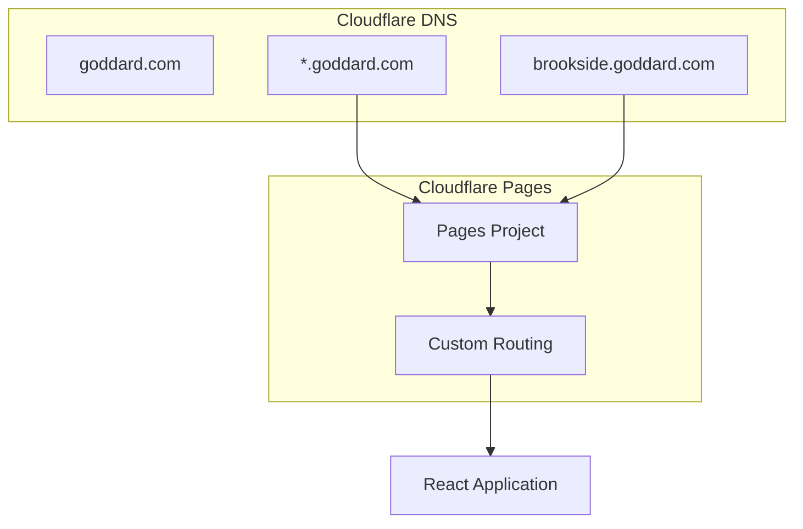
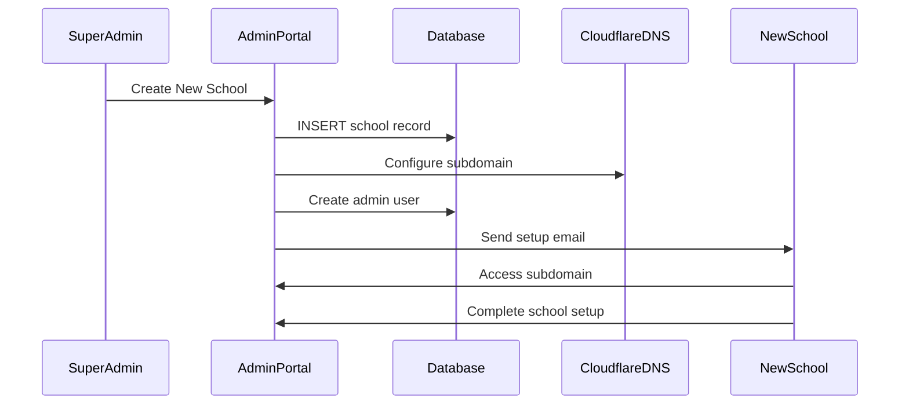

# Subdomain-Based Multi-Tenancy Strategy
## The Goddard School Enrollment Management System

### Overview
This document outlines the subdomain-based multi-tenancy approach for The Goddard School system, where each school operates under its own subdomain (e.g., `brookside.goddard.com`, `riverside.goddard.com`).

---

## 1. Subdomain Architecture

### 1.1 Domain Structure
```
goddard.com (main corporate site)
├── brookside.goddard.com (Brookside School)
├── riverside.goddard.com (Riverside School)
├── oakwood.goddard.com (Oakwood School)
└── admin.goddard.com (Super Admin Portal)
```

### 1.2 DNS Configuration (Cloudflare)


---

## 2. Tenant Resolution Process

### 2.1 Frontend Tenant Detection

```typescript
// utils/tenant.ts
export function extractSchoolFromSubdomain(): string | null {
  const hostname = window.location.hostname;
  
  // Handle localhost development
  if (hostname === 'localhost') {
    return localStorage.getItem('dev_school_id') || 'demo';
  }
  
  // Extract subdomain from production
  const parts = hostname.split('.');
  if (parts.length >= 3 && parts[1] === 'goddard' && parts[2] === 'com') {
    return parts[0]; // Returns 'brookside' from 'brookside.goddard.com'
  }
  
  return null;
}

// App.tsx - Initialize school context
function App() {
  const schoolId = extractSchoolFromSubdomain();
  
  if (!schoolId) {
    return <SchoolNotFound />;
  }
  
  return (
    <SchoolProvider schoolId={schoolId}>
      <Router>
        {/* App routes */}
      </Router>
    </SchoolProvider>
  );
}
```

### 2.2 Backend Tenant Context

```rust
// Lambda function - Extract tenant context
pub async fn extract_school_context(event: &APIGatewayProxyRequest) -> Result<String, Error> {
    // Method 1: From custom header (set by frontend)
    if let Some(school_id) = event.headers.get("x-school-id") {
        return Ok(school_id.to_string());
    }
    
    // Method 2: From JWT claims
    if let Some(jwt_token) = event.headers.get("authorization") {
        let claims = validate_jwt(jwt_token)?;
        if let Some(school_id) = claims.custom.get("school_id") {
            return Ok(school_id.to_string());
        }
    }
    
    // Method 3: From origin header (fallback)
    if let Some(origin) = event.headers.get("origin") {
        return extract_school_from_origin(origin);
    }
    
    Err(Error::new("No school context found"))
}
```

---

## 3. Database Schema for Multi-Tenancy

### 3.1 Core Tables with school_id

```sql
-- Schools table (tenant registry)
CREATE TABLE schools (
    id UUID PRIMARY KEY DEFAULT gen_random_uuid(),
    subdomain VARCHAR(50) UNIQUE NOT NULL,
    name VARCHAR(255) NOT NULL,
    settings JSONB DEFAULT '{}',
    created_at TIMESTAMP DEFAULT NOW(),
    is_active BOOLEAN DEFAULT TRUE
);

-- All tenant-specific tables include school_id
CREATE TABLE users (
    id UUID PRIMARY KEY DEFAULT gen_random_uuid(),
    school_id UUID REFERENCES schools(id) NOT NULL,
    email VARCHAR(255) NOT NULL,
    role user_role NOT NULL,
    -- other fields...
    UNIQUE(school_id, email) -- Ensure unique email per school
);

CREATE TABLE children (
    id UUID PRIMARY KEY DEFAULT gen_random_uuid(),
    school_id UUID REFERENCES schools(id) NOT NULL,
    parent_id UUID REFERENCES users(id) NOT NULL,
    -- other fields...
);

-- Add indexes for performance
CREATE INDEX idx_users_school_id ON users(school_id);
CREATE INDEX idx_children_school_id ON children(school_id);
```

### 3.2 Row Level Security Policies

```sql
-- Enable RLS on all tenant tables
ALTER TABLE users ENABLE ROW LEVEL SECURITY;
ALTER TABLE children ENABLE ROW LEVEL SECURITY;
ALTER TABLE enrollments ENABLE ROW LEVEL SECURITY;

-- Create policies for school isolation
CREATE POLICY users_school_isolation ON users
    FOR ALL
    USING (school_id = (current_setting('app.current_school_id'))::uuid);

CREATE POLICY children_school_isolation ON children
    FOR ALL
    USING (school_id = (current_setting('app.current_school_id'))::uuid);

-- Policy for super admins (bypass school isolation)
CREATE POLICY users_super_admin ON users
    FOR ALL
    TO super_admin_role
    USING (true);
```

---

## 4. Authentication Integration

### 4.1 Supabase Auth with School Context

```typescript
// auth/supabase.ts
export async function signInWithSchool(email: string, password: string, schoolId: string) {
  const { data, error } = await supabase.auth.signInWithPassword({
    email,
    password,
  });
  
  if (error) throw error;
  
  // Set school context in user metadata
  if (data.user) {
    await supabase.auth.updateUser({
      data: { 
        school_id: schoolId,
        current_school: schoolId 
      }
    });
    
    // Set PostgreSQL session variable for RLS
    await supabase.rpc('set_school_context', { school_id: schoolId });
  }
  
  return data;
}

// PostgreSQL function to set session context
CREATE OR REPLACE FUNCTION set_school_context(school_id UUID)
RETURNS void AS $$
BEGIN
  PERFORM set_config('app.current_school_id', school_id::text, false);
END;
$$ LANGUAGE plpgsql;
```

### 4.2 JWT Token Structure

```json
{
  "sub": "user-uuid",
  "email": "parent@example.com",
  "role": "parent",
  "school_id": "brookside-uuid",
  "school_subdomain": "brookside",
  "aud": "authenticated",
  "exp": 1234567890
}
```

---

## 5. Email Templates with School Branding

### 5.1 HTML Email Generation in Lambda

```rust
// email/templates.rs
pub struct EmailTemplate {
    pub school_id: String,
    pub school_name: String,
    pub school_logo_url: Option<String>,
    pub primary_color: String,
    pub template_type: EmailType,
}

impl EmailTemplate {
    pub fn render_enrollment_invitation(&self, parent_name: &str, child_name: &str) -> String {
        format!(r#"
        <!DOCTYPE html>
        <html>
        <head>
            <meta charset="utf-8">
            <title>Welcome to {school_name}</title>
        </head>
        <body style="font-family: Arial, sans-serif; max-width: 600px; margin: 0 auto;">
            <div style="background-color: {primary_color}; padding: 20px; text-align: center;">
                {logo_html}
                <h1 style="color: white; margin: 10px 0;">Welcome to {school_name}!</h1>
            </div>
            
            <div style="padding: 20px;">
                <p>Dear {parent_name},</p>
                
                <p>We're excited to welcome {child_name} to {school_name}! Please click the link below to complete the enrollment process.</p>
                
                <div style="text-align: center; margin: 30px 0;">
                    <a href="https://{subdomain}.goddard.com/enroll" 
                       style="background-color: {primary_color}; color: white; padding: 12px 24px; text-decoration: none; border-radius: 5px;">
                        Complete Enrollment
                    </a>
                </div>
                
                <p>Best regards,<br>The {school_name} Team</p>
            </div>
        </body>
        </html>
        "#,
        school_name = self.school_name,
        primary_color = self.primary_color,
        parent_name = parent_name,
        child_name = child_name,
        subdomain = self.extract_subdomain(),
        logo_html = self.render_logo_html()
        )
    }
}
```

### 5.2 Resend Integration

```rust
// email/resend.rs
pub async fn send_school_email(
    template: EmailTemplate,
    to_email: &str,
    subject: &str,
    html_content: &str
) -> Result<String, EmailError> {
    let client = reqwest::Client::new();
    
    let payload = json!({
        "from": format!("noreply@{}.goddard.com", template.extract_subdomain()),
        "to": [to_email],
        "subject": subject,
        "html": html_content,
        "tags": [
            {
                "name": "school_id",
                "value": template.school_id
            },
            {
                "name": "template_type", 
                "value": template.template_type.to_string()
            }
        ]
    });
    
    let response = client
        .post("https://api.resend.com/emails")
        .header("Authorization", format!("Bearer {}", get_resend_api_key()))
        .header("Content-Type", "application/json")
        .json(&payload)
        .send()
        .await?;
    
    let result: ResendResponse = response.json().await?;
    Ok(result.id)
}
```

---

## 6. Development & Deployment Considerations

### 6.1 Local Development

```bash
# .env.local
VITE_SCHOOL_ID=demo
VITE_API_BASE_URL=http://localhost:3001
VITE_SUPABASE_URL=your-supabase-url
VITE_SUPABASE_ANON_KEY=your-anon-key

# Override subdomain detection in development
if (process.env.NODE_ENV === 'development') {
  window.location.hostname = 'demo.goddard.com'; // Mock subdomain
}
```

### 6.2 Cloudflare Pages Configuration

```toml
# wrangler.toml
name = "goddard-enrollment"
pages = true

[env.production]
routes = [
  { pattern = "*.goddard.com/*", zone_name = "goddard.com" }
]

[[env.production.env_vars]]
REACT_APP_API_BASE_URL = "https://api.goddard.com"
```

### 6.3 School Onboarding Workflow



---

## 7. Security Considerations

### 7.1 Subdomain Validation
- Validate subdomain format (alphanumeric, hyphens only)
- Prevent subdomain hijacking
- Rate limiting per subdomain

### 7.2 Data Isolation
- RLS policies enforce school boundaries
- JWT tokens scoped to specific schools
- API endpoints validate school context

### 7.3 Cross-Tenant Prevention
- No shared user sessions across subdomains
- School-specific JWT signing (if needed)
- Audit logging per tenant

---

## 8. Benefits of This Architecture

✅ **Clear Tenant Separation**: Each school has its own subdomain  
✅ **SEO Friendly**: School-specific URLs  
✅ **Branding**: Custom logos and colors per school  
✅ **Security**: RLS enforces data isolation  
✅ **Scalability**: Easy to add new schools  
✅ **Team Familiarity**: Leverages Cloudflare expertise  
✅ **Development**: Simple local development setup

---

*This strategy provides a robust foundation for multi-tenant SaaS with clear school boundaries and excellent user experience.*