# The Goddard School Enrollment Management System
## High-Level Architecture Design Document

### Executive Summary
This document presents a comprehensive architectural design for The Goddard School Enrollment Management System using React.js hosted on Cloudflare Pages for the frontend, Rust with AWS Lambda for the backend, and Supabase for database, authentication, and real-time services. Email communications are handled by Resend API. The architecture is designed for an initial launch of 10 schools with 50 concurrent users each, prioritizing scalability, security, multi-tenancy, and compliance with childcare regulations (COPPA/FERPA).

---

## 1. System Architecture Overview

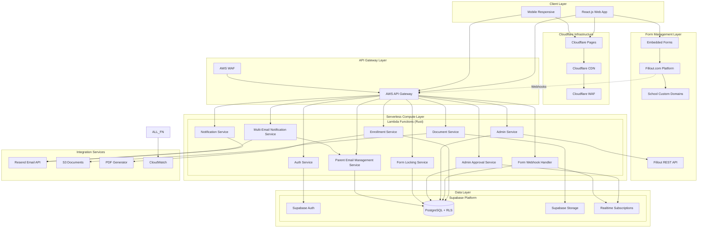

---

## 2. Multi-Tenant Architecture

### 2.1 Tenant Isolation Strategy (Manual Onboarding)

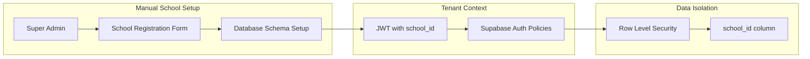

**Manual Onboarding Process:**
1. Super Admin creates new school record
2. School subdomain and basic settings configured
3. Initial admin user created for the school
4. RLS policies automatically apply data isolation
5. School admin can begin customizing forms and settings

### 2.2 Database Schema with Multi-Tenancy & Form Management

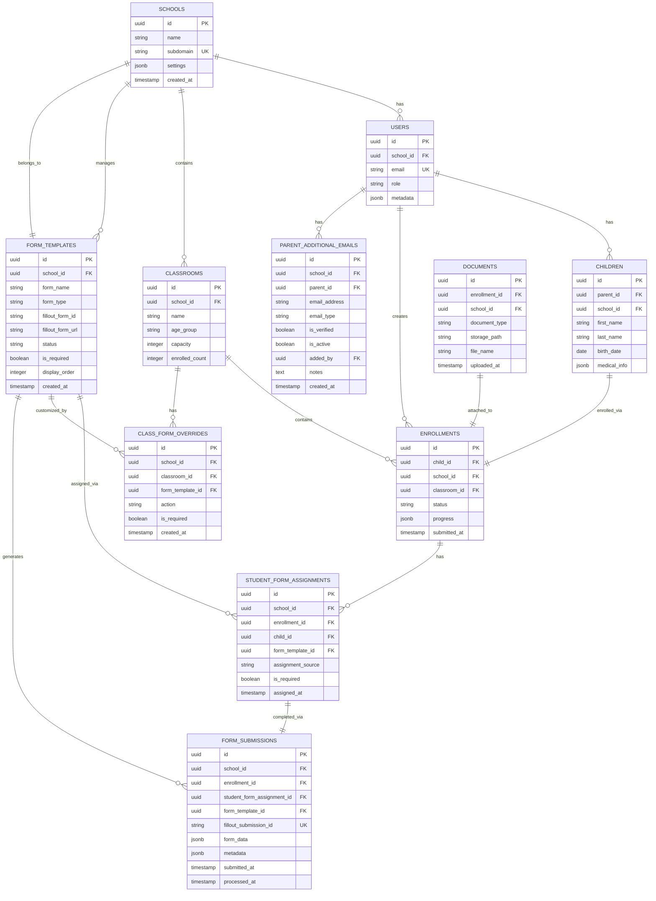

---

## 3. Technical Stack Details

### 3.1 Frontend Architecture (React.js)

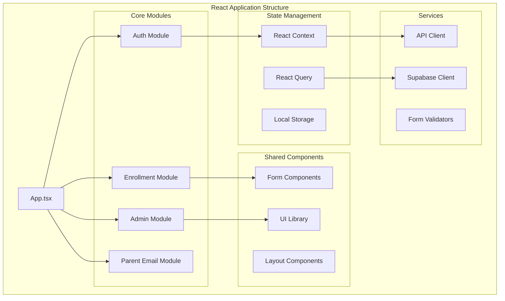

#### Frontend Technology Decisions:
- **Framework**: React 18 with TypeScript
- **Hosting**: Cloudflare Pages with automatic deployments
- **Routing**: React Router v6
- **State Management**: React Context + React Query
- **UI Framework**: Tailwind CSS + Shadcn/ui
- **Form Management**: Fillout.com embedded forms + React integration
- **Form Builder**: Fillout.com Business plan with custom domains
- **Real-time**: Supabase Realtime subscriptions
- **Build Tool**: Vite
- **CDN**: Cloudflare's global edge network

### 3.2 Backend Architecture (Rust + AWS Lambda)

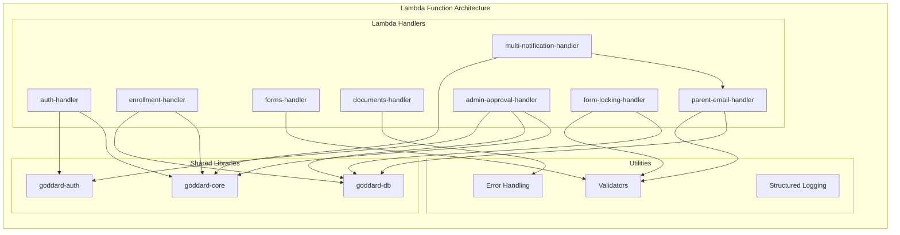

#### Backend Technology Decisions:
- **Runtime**: AWS Lambda with Rust Runtime
- **Framework**: Axum for HTTP handling
- **Database Client**: tokio-postgres with connection pooling
- **Serialization**: Serde with JSON
- **Authentication**: JWT validation with jsonwebtoken
- **Webhook Processing**: Fillout webhook validation and processing
- **Form Integration**: Fillout REST API client
- **Approval Workflow**: Database functions with audit trail
- **Form Locking**: Real-time validation with immutable constraints
- **Multi-Email Notifications**: Queue-based processing with delivery tracking
- **Error Handling**: thiserror + anyhow
- **Logging**: tracing with CloudWatch integration
- **Architecture**: Hexagonal/Ports & Adapters

### 3.3 Database & Authentication (Supabase)

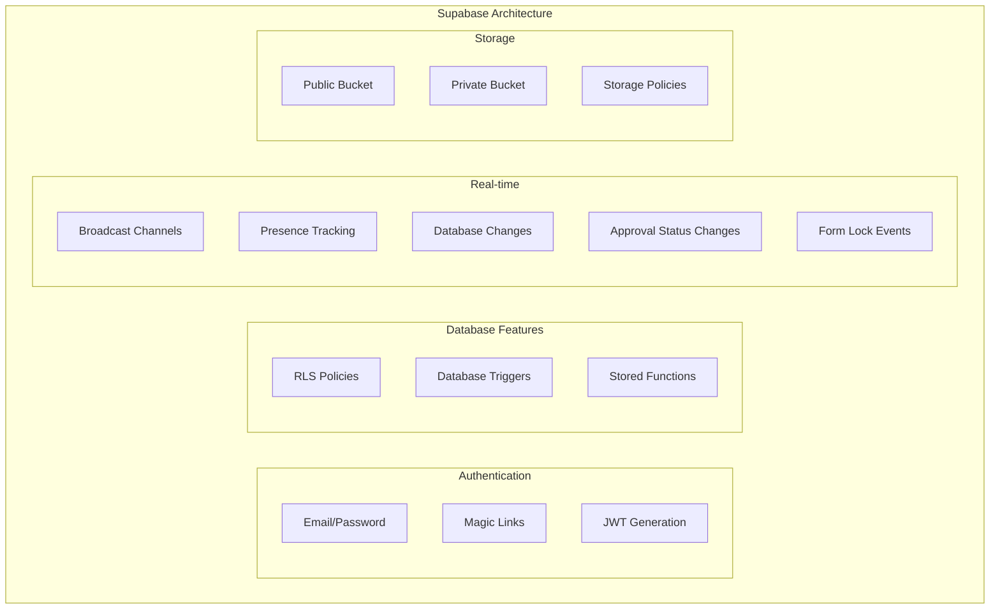

---

## 4. Security Architecture

### 4.1 Security Layers

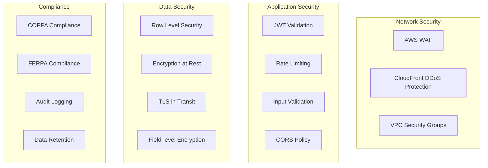

### 4.2 Authentication & Authorization Flow

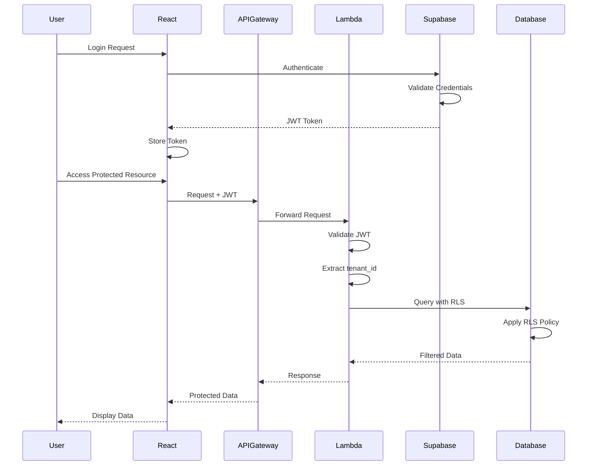

---

## 5. Data Flow Diagrams

### 5.1 Enrollment Process Flow

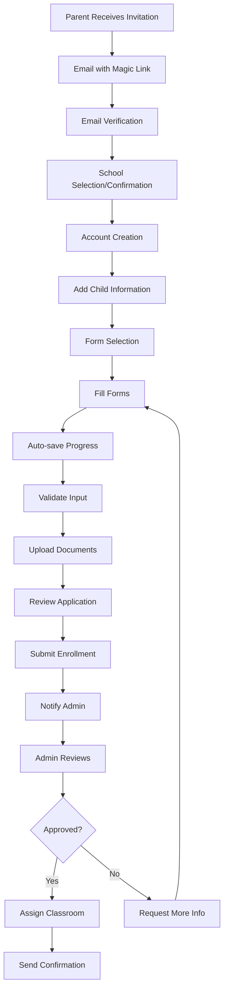

### 5.2 Form Management Flow

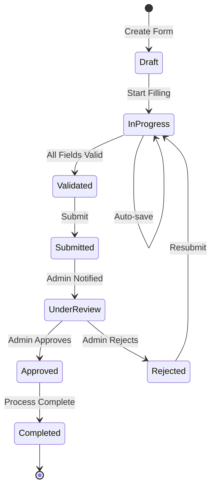

---

## 6. Infrastructure Architecture

### 6.1 Hybrid Infrastructure (Cloudflare + AWS)

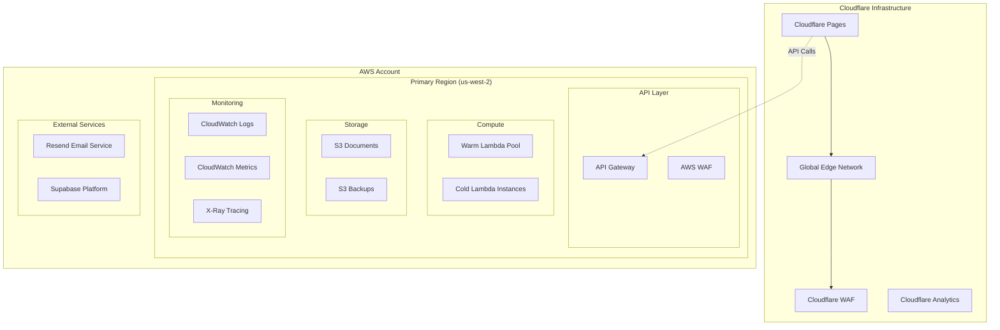

### 6.2 Deployment Pipeline (Cloudflare Pages + AWS)

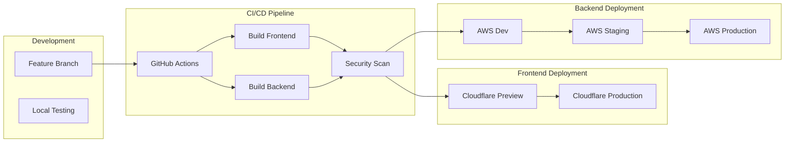

---

## 7. Performance Optimization Strategies

### 7.1 Frontend Optimization
- **Code Splitting**: Lazy load routes and heavy components
- **Bundle Optimization**: Tree shaking, minification
- **Caching Strategy**: Service workers for offline support
- **Image Optimization**: WebP format, lazy loading
- **CDN Distribution**: Static assets via CloudFront

### 7.2 Backend Optimization
- **Lambda Optimization**:
  - Provisioned concurrency for critical functions
  - ARM64 architecture (30% cost reduction)
  - Minimal binary size with release builds
  - Connection pooling with RDS Proxy pattern
  
- **Database Optimization**:
  - Indexed columns for RLS policies
  - Materialized views for reports
  - Connection pooling
  - Query optimization

### 7.3 Caching Architecture

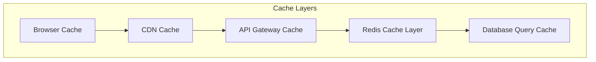

---

## 8. Technical Decisions & Trade-offs

### 8.1 Key Technology Choices

| Component | Technology | Rationale | Trade-offs |
|-----------|------------|-----------|------------|
| **Frontend** | React.js | - Large ecosystem<br>- Component reusability<br>- Strong community | - Bundle size<br>- SEO challenges |
| **Backend** | Rust + Lambda | - 6x faster than Python<br>- Memory safety<br>- Cost efficient | - Longer build times<br>- Smaller talent pool |
| **Database** | Supabase/PostgreSQL | - Built-in RLS<br>- Real-time capabilities<br>- Managed service | - Vendor lock-in<br>- Limited customization |
| **Auth** | Supabase Auth | - Seamless DB integration<br>- Built-in RLS support<br>- Multiple auth providers<br>- JWT + RLS policies | - Single vendor dependency<br>- Less enterprise features |
| **Infrastructure** | AWS Serverless | - Auto-scaling<br>- Pay-per-use<br>- No server management | - Cold starts<br>- Vendor lock-in |

### 8.2 Architectural Patterns

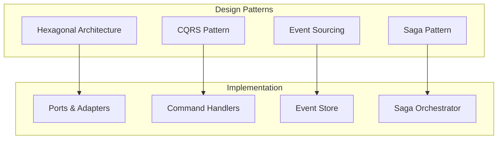

---

## 9. Risk Analysis & Mitigation

### 9.1 Technical Risks

| Risk | Impact | Probability | Mitigation Strategy |
|------|--------|-------------|-------------------|
| **Lambda Cold Starts** | High | Medium | - Provisioned concurrency<br>- Warm-up functions<br>- Optimize bundle size |
| **Supabase Downtime** | Critical | Low | - Multi-region setup<br>- Backup database<br>- Disaster recovery plan |
| **Data Breach** | Critical | Low | - Encryption everywhere<br>- RLS policies<br>- Security audits<br>- PII tokenization |
| **Scaling Issues** | High | Medium | - Load testing<br>- Auto-scaling policies<br>- Performance monitoring |
| **Compliance Violation** | Critical | Low | - Regular audits<br>- Automated compliance checks<br>- Data retention policies |

### 9.2 Mitigation Architecture

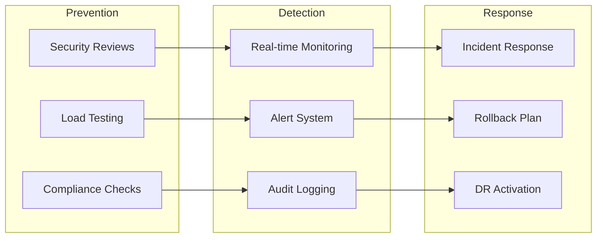

---

## 10. Implementation Roadmap

### 10.1 Phase 1: Foundation (Weeks 1-4)
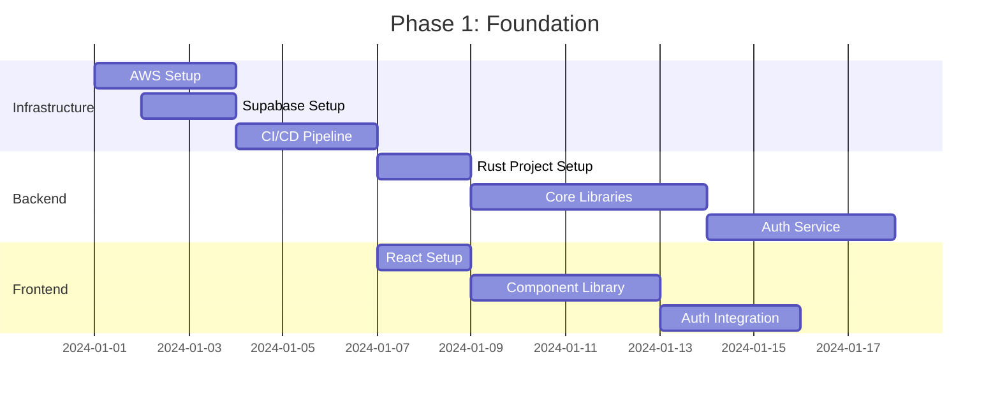

### 10.2 Phase 2: Core Features (Weeks 5-8)
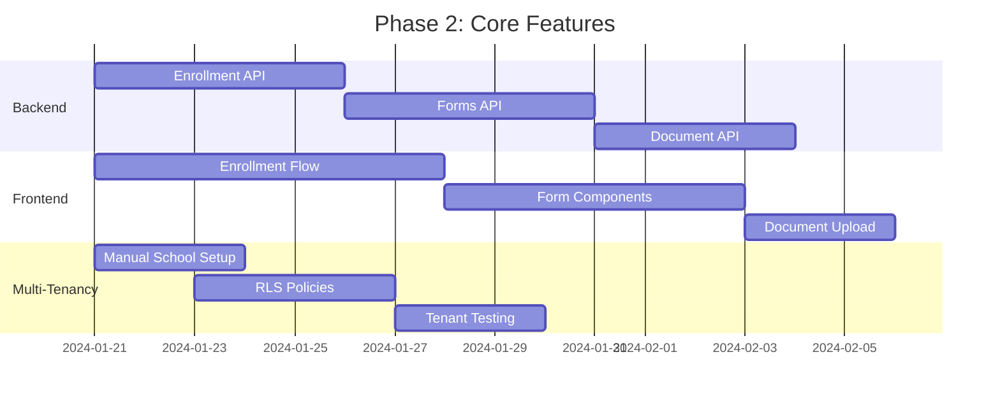

### 10.3 Phase 3: Advanced Features (Weeks 9-12)
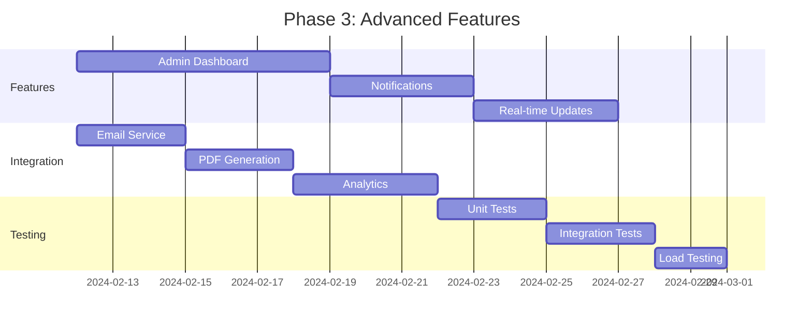

---

## 11. Monitoring & Observability

### 11.1 Monitoring Stack

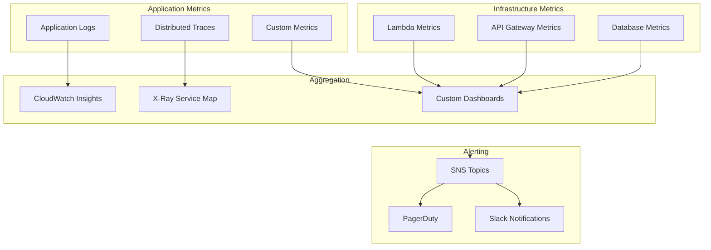

### 11.2 Key Performance Indicators (KPIs) - Optimized for 500 Concurrent Users

| Metric | Target | Alert Threshold | Scaling Notes |
|--------|--------|----------------|---------------|
| **API Response Time (p99)** | < 300ms | > 500ms | Adequate for 500 users |
| **Lambda Cold Start** | < 1s | > 2s | Provisioned concurrency for 10% of capacity |
| **Database Query Time** | < 100ms | > 200ms | Supabase can handle this load easily |
| **Error Rate** | < 0.1% | > 1% | Standard SLA |
| **Form Completion Rate** | > 90% | < 80% | Business success metric |
| **System Uptime** | 99.9% | < 99.5% | 8.76 hours downtime/year max |
| **Concurrent Users** | 500 | > 600 | Auto-scaling threshold |

---

## 12. Cost Optimization

### 12.1 Cost Breakdown Estimation (10 Schools, 500 Concurrent Users)

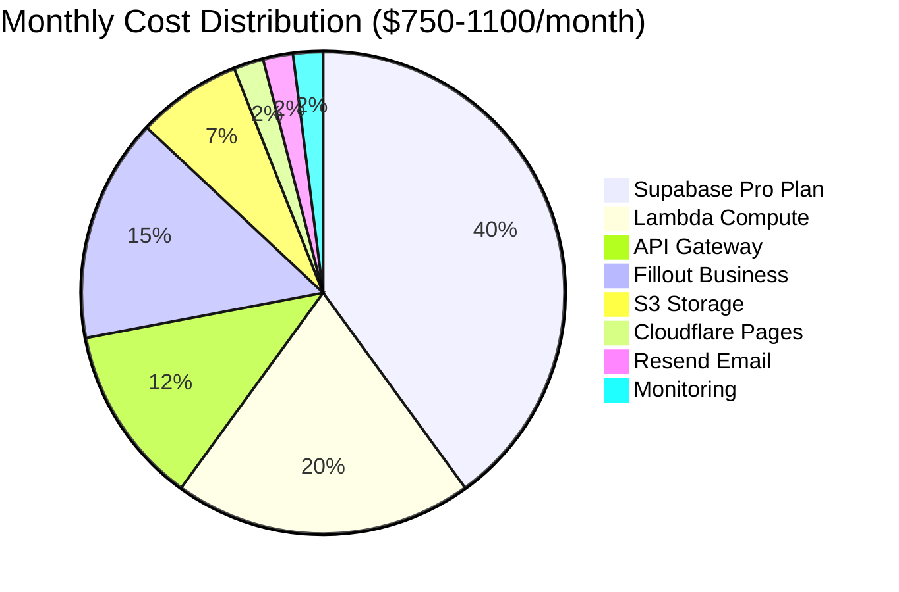

**Estimated Monthly Costs:**
- **Supabase**: $320 (Pro plan for production + staging)
- **AWS Lambda**: $180 (ARM64, optimized)
- **API Gateway**: $120 (500 concurrent users)
- **Fillout Business Plan**: $150 (5,000+ submissions/month)
- **S3 Storage**: $65 (documents + backups)
- **Cloudflare Pages**: $20 (Pro plan for custom domains)
- **Resend**: $20 (up to 100k emails/month)
- **AWS Monitoring**: $15 (CloudWatch, X-Ray)
- **Total**: ~$750-1100/month

**Additional Cost vs Custom Forms:**
- **+$150/month** for Fillout Business plan
- **Development Savings**: 200+ hours of form development avoided
- **Maintenance Savings**: Ongoing form updates and bug fixes eliminated

### 12.2 Cost Optimization Strategies

1. **Lambda Optimization**:
   - Use ARM64 architecture (30% cheaper)
   - Right-size memory allocation
   - Implement request batching
   - Use Lambda@Edge for simple operations

2. **Database Optimization**:
   - Connection pooling to reduce connections
   - Query optimization and indexing
   - Archive old data to S3

3. **Storage Optimization**:
   - S3 Intelligent-Tiering
   - CloudFront caching
   - Compress documents before storage

---

## 13. Disaster Recovery & Business Continuity

### 13.1 DR Strategy

```mermaid
graph TD
    subgraph "Primary Region"
        PRIMARY_APP[Application]
        PRIMARY_DB[Database]
        PRIMARY_STORAGE[Storage]
    end
    
    subgraph "Backup & Replication"
        CONTINUOUS_BACKUP[Continuous Backup]
        CROSS_REGION[Cross-Region Replication]
        SNAPSHOTS[Daily Snapshots]
    end
    
    subgraph "DR Region"
        DR_APP[Standby Application]
        DR_DB[Replica Database]
        DR_STORAGE[Replicated Storage]
    end
    
    PRIMARY_DB --> CONTINUOUS_BACKUP
    PRIMARY_STORAGE --> CROSS_REGION
    PRIMARY_DB --> SNAPSHOTS
    
    CONTINUOUS_BACKUP --> DR_DB
    CROSS_REGION --> DR_STORAGE
    SNAPSHOTS --> DR_DB
```

### 13.2 Recovery Objectives

- **RTO (Recovery Time Objective)**: 1 hour
- **RPO (Recovery Point Objective)**: 15 minutes
- **Backup Retention**: 30 days
- **Archive Retention**: 7 years (compliance requirement)

---

## 14. Form Management System

### 14.1 Form Hierarchy & Assignment

The system implements a three-tier form assignment hierarchy:

```mermaid
graph TD
    subgraph "School Level"
        SCHOOL_FORMS[School Default Forms]
        ACTIVE_FORMS[Active Forms]
        DRAFT_FORMS[Draft Forms]
        ARCHIVE_FORMS[Archived Forms]
    end
    
    subgraph "Class Level"
        CLASS_INCLUDE[Class Include Overrides]
        CLASS_EXCLUDE[Class Exclude Overrides]
    end
    
    subgraph "Student Level"
        INDIVIDUAL[Individual Assignments]
        MATERIALIZED[Materialized Assignments]
    end
    
    SCHOOL_FORMS --> MATERIALIZED
    ACTIVE_FORMS --> CLASS_INCLUDE
    CLASS_INCLUDE --> MATERIALIZED
    CLASS_EXCLUDE -.->|Removes| MATERIALIZED
    INDIVIDUAL --> MATERIALIZED
```

### 14.2 Form States & Workflow

```mermaid
stateDiagram-v2
    [*] --> Draft: Admin creates form
    Draft --> Active: Admin activates
    Draft --> School_Default: Admin sets as default
    Active --> Archive: Admin archives
    School_Default --> Archive: Admin archives
    Active --> School_Default: Admin promotes
    School_Default --> Active: Admin demotes
    Archive --> [*]: Form retired
    
    note right of School_Default
        Automatically assigned
        to new enrollments
    end note
    
    note right of Active
        Available for manual
        assignment only
    end note
    
    note right of Archive
        No new assignments
        but existing remain
    end note
```

### 14.3 Enrollment Form Assignment Process

```mermaid
sequenceDiagram
    participant Admin
    participant System
    participant Database
    participant Parent
    
    Admin->>System: Create new enrollment
    System->>Database: Get school default forms
    System->>Database: Get class exclusions
    System->>Database: Get class inclusions
    System->>System: Calculate final form list
    System->>Database: Create student_form_assignments
    Database-->>System: Assignment IDs created
    System-->>Admin: Enrollment created with forms
    Admin->>Parent: Send enrollment invitation
    Parent->>System: Access enrollment portal
    System->>Database: Get assigned forms
    Database-->>System: Return form list with URLs
    System-->>Parent: Display forms to complete
```

### Confirmed Requirements
✅ **Authentication**: Supabase Auth (replacing Auth0)  
✅ **Tenant Onboarding**: Manual process by Super Admin  
✅ **Launch Scale**: 10 schools, 50 concurrent users per school (500 total)  
✅ **Data Migration**: Clean start, no legacy data  
✅ **Form Management**: Three-tier hierarchy with materialized assignments  
✅ **Form States**: Active, School Default, Draft, Archive  
✅ **Fillout Integration**: URL/ID storage with webhook processing  

### Remaining Questions for Clarification

#### Technical Details
1. **Document size limits**: Maximum size for uploaded documents?
2. **Real-time requirements**: Which features need instant vs. near real-time updates?
3. **Mobile app timeline**: Native mobile app planned for Phase 2?
4. **Payment integration**: Timeline and requirements?

#### Infrastructure
5. **Data residency**: Any requirements for data location?
6. **Third-party integrations**: Any existing systems to integrate with?
7. **Reporting requirements**: Specific reports needed for launch?

---

## 15. Parent Additional Email Management Feature

### 15.1 Feature Overview

The parent additional email management feature allows school administrators to assign and manage multiple email addresses for parents, enhancing communication reach and providing backup contact methods during the enrollment process.

### 15.2 Key Capabilities

- **Multi-Email Support**: Parents can have multiple email addresses beyond their primary login email
- **Email Types**: Categorize emails as additional, work, backup, emergency contact, etc.
- **Admin Management**: School administrators can add, verify, activate/deactivate additional emails
- **Notification Integration**: All active and verified emails receive enrollment notifications
- **Audit Trail**: Track who added each email and when
- **Multi-Tenant Isolation**: Full RLS support for school data isolation

### 15.3 Database Schema Addition

The `parent_additional_emails` table extends the existing user management system:

```sql
PARENT_ADDITIONAL_EMAILS {
    uuid id PK
    uuid school_id FK
    uuid parent_id FK
    string email_address
    string email_type
    boolean is_verified
    boolean is_active
    uuid added_by FK
    text notes
    timestamp created_at
}
```

### 15.4 API Endpoints

- `GET /api/parents/{parentId}/emails` - Get all emails for a parent
- `POST /api/parents/emails` - Add additional email
- `PUT /api/parents/emails/{emailId}` - Update email status/notes
- `DELETE /api/parents/emails/{emailId}` - Remove additional email
- `GET /api/parents/{parentId}/notification-emails` - Get notification-ready emails
- `GET /api/enrollments/{enrollmentId}/notification-emails` - Get enrollment notification emails

### 15.5 Security & Compliance

- **Row Level Security**: All additional email data isolated by school_id
- **Admin-Only Management**: Only school admins can manage additional emails
- **Email Validation**: Server-side email format validation
- **Audit Logging**: Track all email management actions
- **COPPA/FERPA Compliance**: Additional emails follow same data protection standards

### 15.6 Integration Points

- **Notification System**: Enhanced to use all active parent emails
- **Enrollment Process**: Notifications sent to all verified email addresses
- **Admin Dashboard**: Email management interface for parent records
- **Email Service (Resend)**: Multi-recipient support for parent communications

### 15.7 Business Benefits

- **Improved Communication Reach**: Reduce missed notifications due to email issues
- **Parental Flexibility**: Support work emails, backup addresses, emergency contacts
- **Administrative Control**: Centralized email management per school
- **Enhanced Reliability**: Multiple contact paths for critical enrollment communications

## 16. Admin Approval & Form Locking Architecture

### 16.1 Feature Overview

The admin approval and form locking system provides a comprehensive workflow for school administrators to review, approve, reject, or request revisions for enrollment applications. Once approved, all forms are automatically locked to prevent unauthorized changes, ensuring data integrity and compliance.

### 16.2 Core Components

#### 16.2.1 Admin Approval Service Architecture
```mermaid
graph TD
    subgraph "Admin Approval Workflow"
        SUBMIT_QUEUE[Submission Queue]
        APPROVAL_ENGINE[Approval Engine]
        AUDIT_LOGGER[Audit Logger]
        NOTIFICATION_DISPATCHER[Notification Dispatcher]
    end
    
    subgraph "Form Locking Service"
        LOCK_VALIDATOR[Lock Validator]
        IMMUTABLE_STORE[Immutable Storage]
        LOCK_MONITOR[Lock Monitor]
    end
    
    subgraph "Multi-Email Notification Service"
        EMAIL_COLLECTOR[Email Collector]
        QUEUE_PROCESSOR[Queue Processor]
        DELIVERY_TRACKER[Delivery Tracker]
    end
    
    SUBMIT_QUEUE --> APPROVAL_ENGINE
    APPROVAL_ENGINE --> AUDIT_LOGGER
    APPROVAL_ENGINE --> LOCK_VALIDATOR
    APPROVAL_ENGINE --> NOTIFICATION_DISPATCHER
    
    NOTIFICATION_DISPATCHER --> EMAIL_COLLECTOR
    EMAIL_COLLECTOR --> QUEUE_PROCESSOR
    QUEUE_PROCESSOR --> DELIVERY_TRACKER
    
    LOCK_VALIDATOR --> IMMUTABLE_STORE
    LOCK_VALIDATOR --> LOCK_MONITOR
```

### 16.3 Database Architecture Enhancements

#### 16.3.1 Approval Status Tracking
```sql
-- Enhanced enrollments table
ALTER TABLE enrollments ADD COLUMN admin_approval_status VARCHAR(20) DEFAULT 'pending';
ALTER TABLE enrollments ADD COLUMN approved_at TIMESTAMP;
ALTER TABLE enrollments ADD COLUMN approved_by UUID REFERENCES profiles(id);
ALTER TABLE enrollments ADD COLUMN approval_notes TEXT;
ALTER TABLE enrollments ADD COLUMN forms_locked_at TIMESTAMP;

-- Approval audit trail
CREATE TABLE enrollment_approval_audit (
    id UUID PRIMARY KEY DEFAULT gen_random_uuid(),
    school_id UUID REFERENCES schools(id) NOT NULL,
    enrollment_id UUID REFERENCES enrollments(id) NOT NULL,
    admin_id UUID REFERENCES profiles(id) NOT NULL,
    action VARCHAR(20) NOT NULL,
    previous_status VARCHAR(20),
    new_status VARCHAR(20) NOT NULL,
    notes TEXT,
    affected_forms JSONB DEFAULT '[]',
    created_at TIMESTAMP DEFAULT NOW()
);
```

### 16.4 API Service Architecture

#### 16.4.1 Admin Approval Handler
```rust
// Lambda handler structure
pub struct AdminApprovalHandler {
    db_client: Arc<DatabaseClient>,
    audit_service: Arc<AuditService>,
    notification_service: Arc<NotificationService>,
    form_lock_service: Arc<FormLockService>,
}

impl AdminApprovalHandler {
    pub async fn approve_enrollment(&self, enrollment_id: Uuid, admin_id: Uuid, notes: Option<String>) -> Result<ApprovalResponse> {
        // 1. Validate admin permissions
        // 2. Check all required forms completed
        // 3. Update enrollment status
        // 4. Lock all forms
        // 5. Create audit record
        // 6. Trigger notifications
        // 7. Update real-time subscriptions
    }
    
    pub async fn request_revision(&self, enrollment_id: Uuid, admin_id: Uuid, revision_request: RevisionRequest) -> Result<RevisionResponse> {
        // 1. Update enrollment status to 'needs_revision'
        // 2. Unlock specific forms if specified
        // 3. Create audit record with affected forms
        // 4. Queue revision request notifications
    }
}
```

### 16.5 Form Locking Mechanism

#### 16.5.1 Lock Validation Flow
```mermaid
sequenceDiagram
    participant Parent
    participant FormWebhook
    participant LockValidator
    participant Database
    participant AuditLog
    
    Parent->>FormWebhook: Submit form data
    FormWebhook->>LockValidator: Validate submission allowed
    LockValidator->>Database: Check enrollment approval status
    Database-->>LockValidator: Return status & lock info
    
    alt Forms are locked
        LockValidator-->>FormWebhook: Reject: Forms locked
        FormWebhook-->>Parent: Error: Cannot modify locked forms
        FormWebhook->>AuditLog: Log blocked submission attempt
    else Forms unlocked
        LockValidator-->>FormWebhook: Allow submission
        FormWebhook->>Database: Process form submission
        Database-->>FormWebhook: Submission saved
        FormWebhook-->>Parent: Success response
    end
```

### 16.6 Real-time Updates Architecture

#### 16.6.1 Approval Event Broadcasting
```rust
// Supabase Realtime integration
pub async fn broadcast_approval_event(
    supabase_client: &SupabaseClient,
    enrollment_id: Uuid,
    event_type: ApprovalEventType,
    event_data: ApprovalEventData,
) -> Result<()> {
    let channel = format!("enrollment:{}", enrollment_id);
    
    supabase_client
        .realtime()
        .channel(&channel)
        .send(json!({
            "event": event_type.to_string(),
            "payload": event_data,
            "timestamp": Utc::now(),
        }))
        .await?;
        
    Ok(())
}
```

### 16.7 Notification Architecture

#### 16.7.1 Multi-Email Processing Pipeline
```mermaid
graph LR
    subgraph "Notification Trigger"
        APPROVAL_ACTION[Admin Action]
        STATUS_CHANGE[Status Change Event]
    end
    
    subgraph "Email Collection"
        GET_PRIMARY[Get Primary Email]
        GET_ADDITIONAL[Get Additional Emails]
        MERGE_LISTS[Merge & Deduplicate]
    end
    
    subgraph "Queue Processing"
        QUEUE_BATCH[Batch Queue Items]
        SEND_EMAILS[Send via Resend API]
        TRACK_DELIVERY[Track Delivery Status]
    end
    
    APPROVAL_ACTION --> STATUS_CHANGE
    STATUS_CHANGE --> GET_PRIMARY
    STATUS_CHANGE --> GET_ADDITIONAL
    GET_PRIMARY --> MERGE_LISTS
    GET_ADDITIONAL --> MERGE_LISTS
    MERGE_LISTS --> QUEUE_BATCH
    QUEUE_BATCH --> SEND_EMAILS
    SEND_EMAILS --> TRACK_DELIVERY
```

### 16.8 Security & Compliance

#### 16.8.1 Approval Authorization Matrix
| Role | View Enrollments | Approve/Reject | Request Revision | View Audit Trail |
|------|------------------|----------------|------------------|------------------|
| **Parent** | Own only | ❌ | ❌ | Own only |
| **Teacher** | Assigned classes | ❌ | ❌ | ❌ |
| **Admin** | School-wide | ✅ | ✅ | School-wide |
| **Super Admin** | All schools | ✅ | ✅ | All schools |

#### 16.8.2 Data Protection
- **Form Lock Immutability**: Approved forms cannot be unlocked except via official revision requests
- **Audit Compliance**: Complete history of all approval actions with timestamps and admin identification
- **Multi-Email Privacy**: Additional email addresses follow same COPPA/FERPA protections
- **Real-time Security**: All broadcast channels require authentication and school context

### 16.9 Performance Considerations

#### 16.9.1 Optimization Strategies
- **Database Functions**: Complex approval logic implemented as stored procedures
- **Connection Pooling**: Shared database connections across Lambda functions
- **Async Processing**: Non-blocking notification queue processing
- **Caching**: Approval status cached in Redis for high-frequency checks
- **Batch Operations**: Multiple email notifications processed in batches

### 16.10 Monitoring & Alerting

#### 16.10.1 Key Metrics
- **Approval Processing Time**: Average time from submission to admin decision
- **Form Lock Compliance**: Percentage of blocked unauthorized edit attempts
- **Multi-Email Delivery Rate**: Success rate of notification delivery to all parent emails
- **API Response Times**: Performance metrics for approval endpoints
- **Queue Processing**: Notification queue depth and processing times

## 17. Conclusion

This architecture design provides a robust, scalable, and secure foundation for The Goddard School Enrollment Management System. The combination of React.js, Rust with AWS Lambda, and Supabase offers:

### ✅ **Strengths**
- **Performance**: 6x faster than traditional Python/Node.js backends
- **Cost-effective**: Serverless pay-per-use model with ARM64 optimization
- **Scalable**: Auto-scaling with no infrastructure management
- **Secure**: Multiple security layers with RLS and compliance features
- **Modern**: Real-time capabilities and excellent developer experience

### ⚠️ **Considerations**
- **Cold starts**: Mitigated with provisioned concurrency
- **Rust learning curve**: Offset by long-term performance benefits
- **Vendor dependencies**: Balanced with portable architecture patterns

The architecture is designed to evolve from a focused enrollment system to a comprehensive school management platform, with clear separation of concerns and well-defined boundaries that facilitate future enhancements.

---

## Appendix A: Technology Stack Summary (Updated)

| Layer | Technology | Version | Purpose | Scale Justification |
|-------|------------|---------|---------|---------------------|
| **Frontend** | React.js | 18.x | UI Framework | Handles 500 concurrent users easily |
| | TypeScript | 5.x | Type Safety | Developer productivity |
| | Vite | 5.x | Build Tool | Fast builds for CI/CD |
| | Tailwind CSS | 3.x | Styling | Component-based styling |
| | React Query | 5.x | Data Fetching | Caching for performance |
| **Hosting** | Cloudflare Pages | - | Static Hosting | Global CDN, team familiarity |
| **Forms** | Fillout.com | Business | Form Builder | 10+ forms with 3-tier assignment hierarchy |
| **Email** | Resend | - | Email Service | Developer-friendly API |
| **Backend** | Rust | 1.75+ | Language | Performance for 500 concurrent |
| | AWS Lambda | - | Compute | Auto-scales to demand |
| | Axum | 0.7 | Web Framework | Efficient HTTP handling |
| **Database** | Supabase | Pro | BaaS Platform | Includes auth, realtime, storage |
| | PostgreSQL | 15.x | Database | Handles multi-tenant load |
| **Auth** | Supabase Auth | - | Authentication | Integrated with RLS |
| **Infrastructure** | AWS + Cloudflare | - | Hybrid Cloud | Best of both platforms |
| | Terraform | 1.6 | IaC | Infrastructure management |
| | GitHub Actions | - | CI/CD | Dual deployment automation |

## Appendix B: Security Compliance Checklist

- [ ] COPPA compliance implementation
- [ ] FERPA compliance implementation
- [ ] PII encryption at rest
- [ ] PII encryption in transit
- [ ] Audit logging for all data access
- [ ] Data retention policies
- [ ] Right to deletion (GDPR-ready)
- [ ] Security incident response plan
- [ ] Regular security audits
- [ ] Penetration testing schedule

---

*This document represents the initial high-level design and will evolve based on feedback, prototyping results, and changing requirements.*